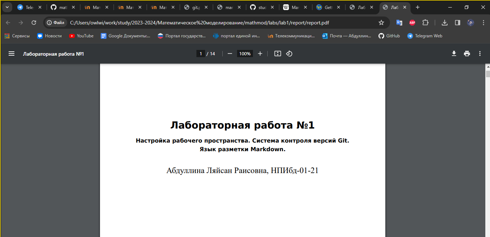

---
## Front matter
lang: ru-RU
title: Лабораторная работа №1
subtitle: Подготовка рабочего пространства 
author:
  - Абдуллина Ляйсан Раисовна
institute:
  - Российский университет дружбы народов, Москва, Россия
date: 09 февраля 2024

babel-lang: russian
babel-otherlangs: english
mainfont: Arial
monofont: Courier New
fontsize: 12pt

## Formatting pdf
toc: false
toc-title: Содержание
slide_level: 2
aspectratio: 169
section-titles: true
theme: metropolis
header-includes:
 - \metroset{progressbar=frametitle,sectionpage=progressbar,numbering=fraction}
 - '\makeatletter'
 - '\beamer@ignorenonframefalse'
 - '\makeatother'
---

# Цель работы

Настроить рабочее пространство для лабораторной работы. Изучить систему контроля версий Git и язык разметки Markdown.

# Задание

Склонировать репозиторий. При помощи Make сконвертировать из файла .md файлы отчетов в форматах docx и pdf.

# Выполнение лабораторной работы

Для начала мы скачали ресурсы pandoc и  make через PowerShell, а также установили LaTex. (Рис. 1-3).

{#fig:001 width=70%}

# Выполнение лабораторной работы

{#fig:002 width=70%}

# Выполнение лабораторной работы

{#fig:012 width=70%}

# Создание репозитория курса на основе шаблона
Репозиторий на основе шаблона можно создать либо вручную, через web-интерфейс, либо с помощью утилит gh. Мы проделовали с помощью утилит gh. (Рис. 4-7).

Например, для 2023–2024 учебного года и предмета «Математическое моделирование» (аббревиатура предмета — mathmod) создание репозитория примет следующий вид:

mkdir -p ~/work/study/2023-2024/"Математическое моделирование"

cd ~/work/study/2023-2024/"Математическое моделирование"

gh repo create study_2023-2024_mathmod --template=yamadharma course-directory-student-template --public

git clone --recursive git@github.com:andullina LR/study_2023-2024_mathmod.git mathmod

# Создание репозитория курса на основе шаблона

{#fig:003 width=70%}

# Создание репозитория курса на основе шаблона

{#fig:004 width=70%}

# Создание репозитория курса на основе шаблона

{#fig:005 width=70%}

# Создание репозитория курса на основе шаблона

{#fig:006 width=70%}

# Настройка каталога курса

Перешли в каталог курса:

cd ~/work/study/2023-2024/"Математическое моделирование"/mathmod

Удалили лишние файлы:

rm package.json

Зашли в msys2 и прописали следующие команды(Рис. 8-9):

echo mathmod > COURSE

make prepare

# Настройка каталога курса

{#fig:007 width=70%}

# Настройка каталога курса

{#fig:008 width=70%}

Таким образом добавили папку labs со всем ее содержимым. Далее запушили все изменения на гитхаб (Рис. 10-12).

Отправляем файлы на сервер:

git add .

git commit -am 'feat(main): make course structure'

git push

# Настройка каталога курса

{#fig:010 width=70%}

# Настройка каталога курса

{#fig:011 width=70%}

# Настройка каталога курса

{#fig:009 width=70%}

# Конвертирование из Markdown

Осталось лишь конвертировать наш отчет  в форматы pdf и docx с помощью команд (Рис. 13-16):

pandoc report.md -o report.<нужный формат> --pdf-engine=lualatex -V mainfont="Times New Roman" -V sansfont="DejaVu Sans" -V monofont="DejaVu Sans Mono"

{#fig:015 width=70%}

# Конвертирование из Markdown

{#fig:016 width=70%}

# Конвертирование из Markdown

{#fig:017 width=70%}

# Конвертирование из Markdown

{#fig:018 width=70%}

# Выводы

Мы смогли настроить рабочее пространство для лабораторной работы. Изучили систему контроля версий Git и язык разметки Markdown, атакже выполнили поставленне задачи.

