---
## Front matter
title: "Лабораторная работа №1"
subtitle: "Настройка рабочего пространства. Система контроля версий Git. Язык разметки Markdown."
author: "Абдуллина Ляйсан Раисовна, НПИбд-01-21"

## Generic otions
lang: ru-RU
toc-title: "Содержание"

## Bibliography
bibliography: bib/cite.bib
csl: pandoc/csl/gost-r-7-0-5-2008-numeric.csl

## Pdf output format
toc: true # Table of contents
toc-depth: 2
lof: true # List of figures
fontsize: 12pt
linestretch: 1.5
papersize: a4
documentclass: scrreprt
## I18n polyglossia
polyglossia-lang:
  name: russian
  options:
	- spelling=modern
	- babelshorthands=true
polyglossia-otherlangs:
  name: english
## I18n babel
babel-lang: russian
babel-otherlangs: english
## Fonts
mainfont: PT Serif
romanfont: PT Serif
sansfont: PT Sans
monofont: PT Mono
mainfontoptions: Ligatures=TeX
romanfontoptions: Ligatures=TeX
sansfontoptions: Ligatures=TeX,Scale=MatchLowercase
monofontoptions: Scale=MatchLowercase,Scale=0.9
## Biblatex
biblatex: true
biblio-style: "gost-numeric"
biblatexoptions:
  - parentracker=true
  - backend=biber
  - hyperref=auto
  - language=auto
  - autolang=other*
  - citestyle=gost-numeric

## Pandoc-crossref LaTeX customization
figureTitle: "Скриншот"
tableTitle: "Таблица"
listingTitle: "Листинг"
lofTitle: "Список иллюстраций"
lotTitle: "Список таблиц"
lolTitle: "Листинги"
## Misc options
indent: true
header-includes:
  - \usepackage{indentfirst}
  - \usepackage{float} # keep figures where there are in the text
  - \floatplacement{figure}{H} # keep figures where there are in the text
---

# Цель работы

Настроить рабочее пространство для лабораторной работы. Изучить систему контроля версий Git и язык разметки Markdown.

# Задание

Склонировать репозиторий. При помощи Make сконвертировать из файла .md файлы отчетов в форматах docx и pdf.

# Теоретическое введение

## Git

Git — система управления версиями с распределенной архитектурой. В отличие от некогда популярных систем вроде CVS и Subversion (SVN), где полная история версий проекта доступна лишь в одном месте, в Git каждая рабочая копия кода сама по себе является репозиторием. Это позволяет всем разработчикам хранить историю изменений в полном объеме.

Разработка в Git ориентирована на обеспечение высокой производительности, безопасности и гибкости распределенной системы.

## Markdown

Markdown — облегчённый язык разметки, созданный с целью обозначения форматирования в простом тексте, с максимальным сохранением его читаемости человеком, и пригодный для машинного преобразования в языки для продвинутых публикаций (HTML, Rich Text и других).

# Выполнение лабораторной работы

Для начала мы скачали ресурсы pandoc и  make через PowerShell, а также установили LaTex. (Рис. 1-3).

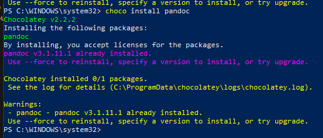{#fig:001 width=70%}

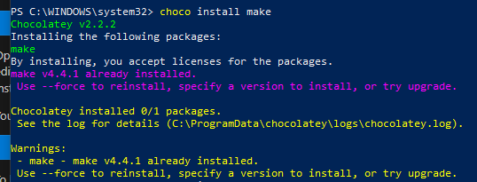{#fig:002 width=70%}

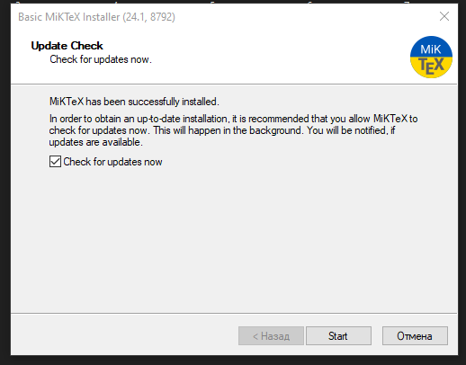{#fig:012 width=70%}

### Создание репозитория курса на основе шаблона
Репозиторий на основе шаблона можно создать либо вручную, через web-интерфейс, либо с помощью утилит gh. Мы проделовали с помощью утилит gh. (Рис. 4-7).

Например, для 2023–2024 учебного года и предмета «Математическое моделирование» (аббревиатура предмета — mathmod) создание репозитория примет следующий вид:

mkdir -p ~/work/study/2023-2024/"Математическое моделирование"

cd ~/work/study/2023-2024/"Математическое моделирование"

gh repo create study_2023-2024_mathmod --template=yamadharma course-directory-student-template --public

git clone --recursive git@github.com:andullina LR/study_2023-2024_mathmod.git mathmod

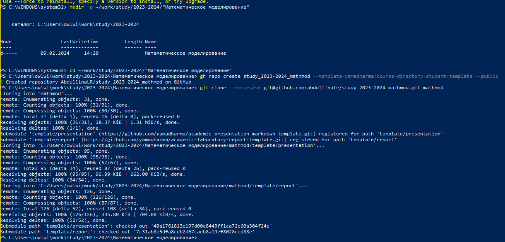{#fig:003 width=70%}

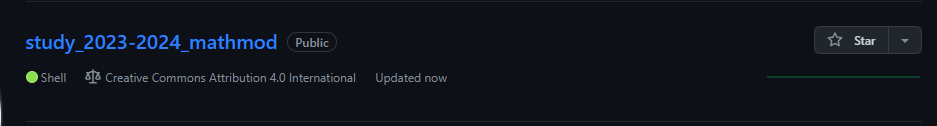{#fig:004 width=70%}

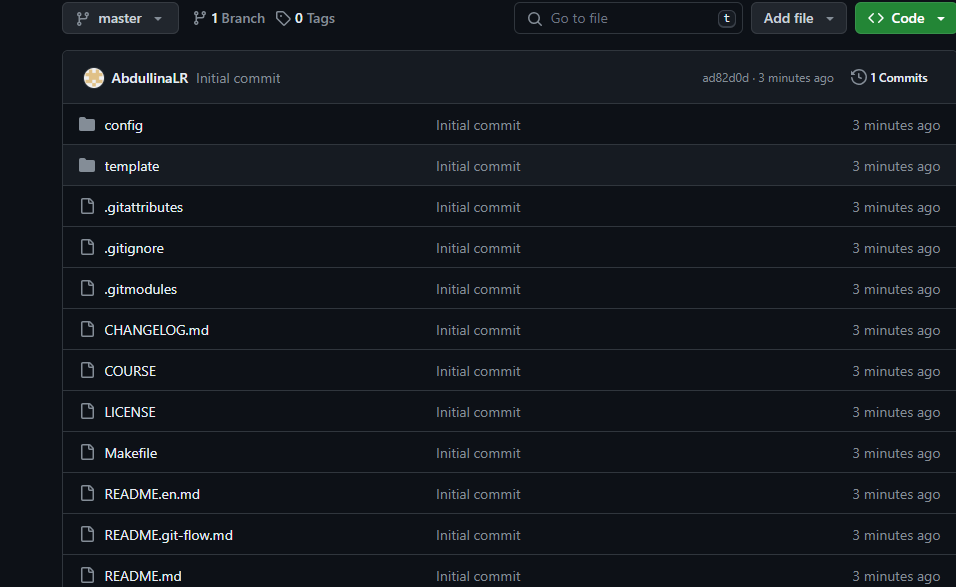{#fig:005 width=70%}

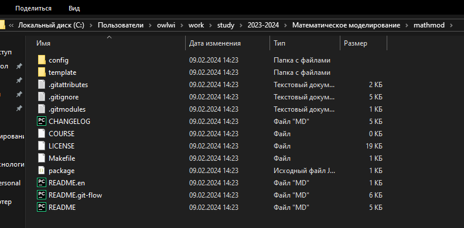{#fig:006 width=70%}

### Настройка каталога курса
Перешли в каталог курса:

cd ~/work/study/2023-2024/"Математическое моделирование"/mathmod

Удалили лишние файлы:

rm package.json

Зашли в msys2 и прописали следующие команды (Рис. 8-9):

echo mathmod > COURSE

make prepare

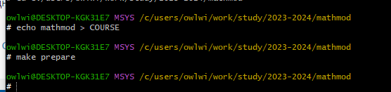{#fig:007 width=70%}

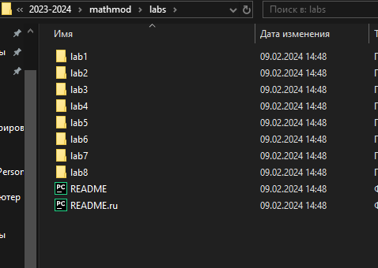{#fig:008 width=70%}

Таким образом добавили папку labs со всем ее содержимым. Далее запушили все изменения на гитхаб (Рис. 10 - 12).

Отправляем файлы на сервер:

git add .

git commit -am 'feat(main): make course structure'

git push

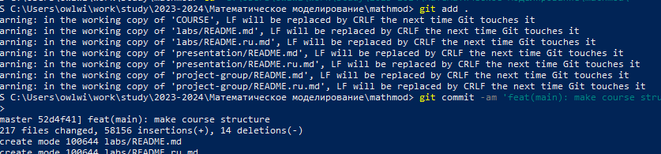{#fig:010 width=70%}

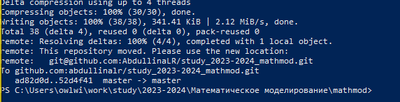{#fig:011 width=70%}

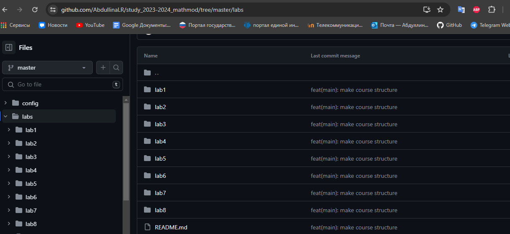{#fig:009 width=70%}

## Конвертирование из Markdown

Осталось лишь конвертировать наш отчет  в форматы pdf и docx с помощью команд (Рис. 13-16):

pandoc report.md -o report.<нужный формат> --pdf-engine=lualatex -V mainfont="Times New Roman" -V sansfont="DejaVu Sans" -V monofont="DejaVu Sans Mono"

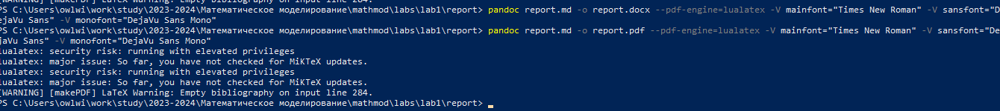{#fig:015 width=70%}

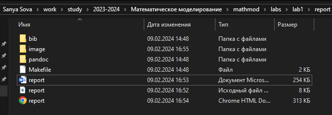{#fig:016 width=70%}

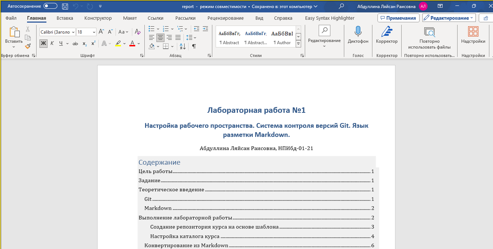{#fig:017 width=70%}

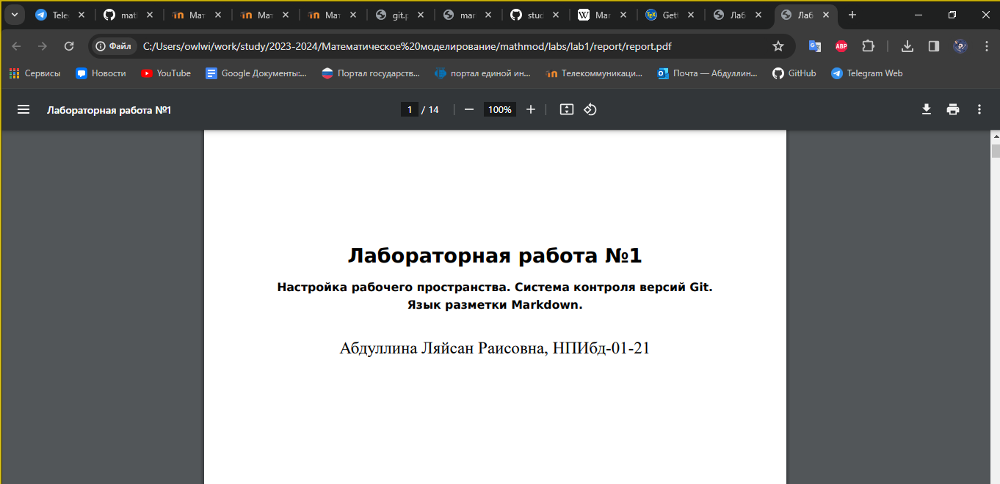{#fig:018 width=70%}

# Выводы

Мы смогли настроить рабочее пространство для лабораторной работы. Изучили систему контроля версий Git и язык разметки Markdown, атакже выполнили поставленне задачи.
