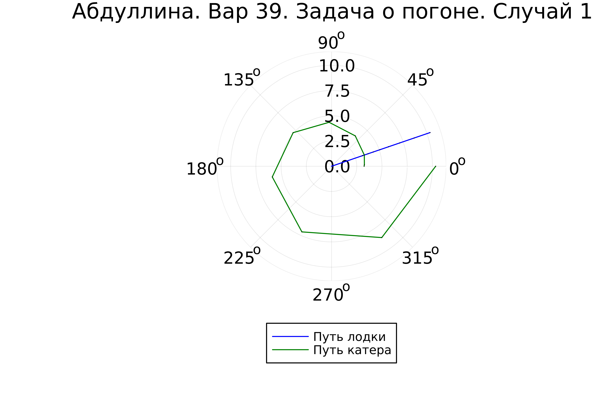

---
## Front matter
lang: ru-RU
title: Лабораторная работа №2
subtitle: Работа с Julia
author:
  - Абдуллина Ляйсан Раисовна
institute:
  - Российский университет дружбы народов, Москва, Россия
date: 09 февраля 2024

babel-lang: russian
babel-otherlangs: english
mainfont: Arial
monofont: Courier New
fontsize: 12pt

## Formatting pdf
toc: false
toc-title: Содержание
slide_level: 2
aspectratio: 169
section-titles: true
theme: metropolis
header-includes:
 - \metroset{progressbar=frametitle,sectionpage=progressbar,numbering=fraction}
 - '\makeatletter'
 - '\beamer@ignorenonframefalse'
 - '\makeatother'
---

# Цель работы

Решить задачу о погоне. Изучить основы языков программирования OpenModelica и Julia.

# Задачи

1. Запишите уравнение, описывающее движение катера, с начальными условиями для двух случаев (в зависимости от расположения катера относительно лодки в начальный момент времени).

2. Постройте траекторию движения катера и лодки для двух случаев.

3. Найдите точку пересечения траектории катера и лодки

# Выполнение лабораторной работы

Выбор варианта вычислялся из остатка деления студенческого билета на количесвто вариантов, плюс один. Таким образом Получили 39 вариант (Рис.1).

{#fig:001 width=70%}

# Выполнение лабораторной работы

## Произведение расчетов

3. Чтобы найти расстояние x (расстояние после которого катер начнет двигаться вокруг полюса), необходимо составить следующие уравнение. Пусть через время t катер и лодка окажутся на одном расстоянии x от полюса. За это время лодка пройдет $x$, а катер $21 + x$ (или $21 - x$, в зависимости от начального положения катера относительно полюса). Время, за которое они пройдут это расстояние, вычисляется как $x / v$ или (${21 - x})/{5,5v}$, ((${21 + x})/{5,5v}$). Так как время должно быть одинаковым, эти величины тоже будут друг другу равны. Из этого получаем объединение из двух уравнений (двух из-за двух разных изначальных позиций катера относительно полюса):

# Выполнение лабораторной работы

$$ \left[ \begin{array}{cl}
{{x}/{v}} = {({21 - x})/{5,5v}}\\
{{x}/{v}} = {({21 + x})/{5,5v}}
\end{array} \right. $$

# Выполнение лабораторной работы

Из данных уравнений можно найти расстояние, после которого катер начнёт раскручиваться по спирали. Для данных уравнений решения будут следующими(Рис.2-3): $x_1 = {{42}/{13}}$, $x_2 = {{14}/{3}}$. 

{#fig:002 width=70%}

# Выполнение лабораторной работы

{#fig:003 width=70%}

# Выполнение лабораторной работы

Задачу будем решать для двух случаев. После того, как катер береговой охраны окажется на одном расстоянии от полюса, что и лодка, он должен сменить прямолинейную траекторию и начать двигаться вокруг полюса удаляясь от него со скоростью лодки v. (Рис.4)

{#fig:004 width=70%}

# Выполнение лабораторной работы

Для этого скорость катера раскладываем на две составляющие: $v_r = {dr/ dt} = v$ - радиальная скорость и $v_\tau = r{d\theta/ dt}$ - тангенциальная скорость (Рис.5).

$$ v_\tau = {{3\sqrt{13}v}/{2}} $$

{#fig:005 width=70%}

# Выполнение лабораторной работы

4. Решение исходной задачи сводится к решению системы из двух дифференциальных уравнений:

$$ \left\{ \begin{array}{cl}
{dr/ dt} = v \\
r{d\theta/ dt} = {{3\sqrt{13}v}/{2}}
\end{array} \right. $$

с начальными условиями 

$$ \left\{ \begin{array}{cl}
\theta_0 = 0 \\
r_0 = x_1 = {{42}/{13}}
\end{array} \right. $$

или

$$ \left\{ \begin{array}{cl}
\theta_0 = -\pi \\
r_0 = x_2 = {{14}/{3}}
\end{array} \right. $$

# Выполнение лабораторной работы

Исключая из полученной системы производную по t, можно перейти к следующему уравнению (с неизменными начальными условиями):

$$ {dr/ d\theta} = {2r/3\sqrt{13}} $$

Решением этого уравнения с заданными начальными условиями и будет являться траектория движения катера в полярных координатах.

# Выполнение лабораторной работы

## Моделирование

OpenModelica не может быть использована для этой задачи, так как здесь используются полярные координаты.

Установка Julia и необходимх для нее пакетов (Рис.6).

{#fig:006 width=70%}

# Выполнение лабораторной работы

## Результаты работы

{#fig:008 width=70%}

# Выполнение лабораторной работы

{#fig:009 width=70%}

# Выводы

Мы смогли решить задачу о погоне, изучить основы языков программирования Julia, а также выполнили все поставленные задачи: были построены графики для обоих случаев, где получилось отрисовать трактерию катера, траекторию лодки и получилось наглядно найти их точки пересечения. 

