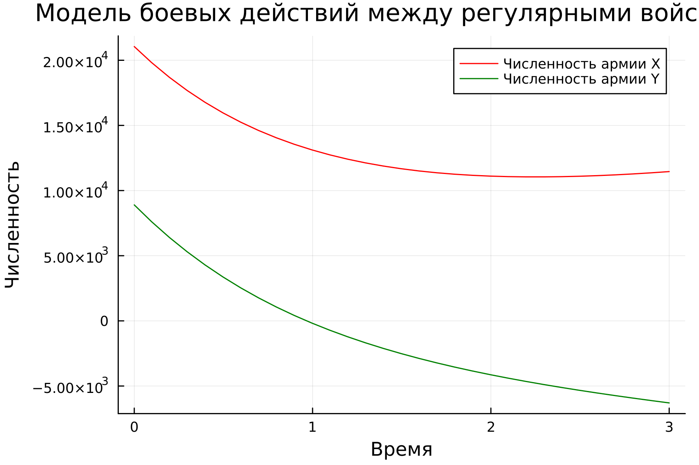

---
## Front matter
lang: ru-RU
title: Лабораторная работа №3
subtitle: 
author:
  - Абдуллина Ляйсан Раисовна
institute:
  - Российский университет дружбы народов, Москва, Россия
date: 09 февраля 2024

babel-lang: russian
babel-otherlangs: english
mainfont: Arial
monofont: Courier New
fontsize: 12pt

## Formatting pdf
toc: false
toc-title: Содержание
slide_level: 2
aspectratio: 169
section-titles: true
theme: metropolis
header-includes:
 - \metroset{progressbar=frametitle,sectionpage=progressbar,numbering=fraction}
 - '\makeatletter'
 - '\beamer@ignorenonframefalse'
 - '\makeatother'
---

# Цель работы

Решить задачу о модели боевых действий.

# Задачи

Рассмотреть 2 модели боя. Проверить, как работает модель в различных ситуациях, построить графики в рассматриваемых случаях. Определить победителя, найти условие при котором та или другая сторона выигрывают бой (для каждого случая).

1. Модель боевых действий между регулярными войсками

2. Модель ведение боевых действий с участием регулярных войск и партизанских отрядов 

# Условие варианта 39

Между страной Х и страной У идет война. Численность состава войск исчисляется от начала войны, и являются временными функциями x(t) и y(t). В начальный момент времени страна Х имеет армию численностью 21 050 человек, а в распоряжении страны У армия численностью в 8 900 человек. Для упрощения
модели считаем, что коэффициенты a, b, c, h постоянны. Также считаем P(t) и Q(t) непрерывные функции.
Постройте графики изменения численности войск армии Х и армии 
У для следующих случаев:

# Условие варианта 39

1. Модель боевых действий между регулярными войсками

 dx/dy = -0.32x(t) - 0.74y(t) + 2 |sin(t)|

 dy/dt = -0.44x(t) - 0.52y(t) + 2 |cos(t)|

# Условие варианта 39

2. Модель ведение боевых действий с участием регулярных войск и партизанских отрядов

 dx/dy = -0.39x(t) - 0.84y(t) + |sin(2t)|

 dy/dt = -0.42x(t)y(t) - 0.49y(t) + |cos(2t)|

# Модель боевых действий между регулярными войсками.

Зададим коэффициент смертности, не связанный с боевыми действиями у первой армии 0,32, у второй 0,44. Коэффициенты эффективности первой и второй армии 0,74 и 0,52 соответственно. Функция, описывающая подход подкрепление первой армии, P (t) = sin(t) , подкрепление второй армии описывается функцией Q(t) = cos(t).
Тогда получим следующую систему, описывающую противостояние между регулярными войсками X и Y:

# Модель боевых действий между регулярными войсками.

 dx/dy = -0.32x(t) - 0.74y(t) + 2 * |sin(t)|

 dy/dt = -0.44x(t) - 0.52y(t) + 2 * |cos(t)|

Зададим начальные условия:
 $x_0 = 21 050$
 
 $y_0 = 8 900$

## Модель ведение боевых действий с участием регулярных войск и партизанских отрядов.

Зададим коэффициент смертности, не связанный с боевыми действиями у первой армии 0,32, у второй 0,44. Коэффициенты эффективности первой и второй армии 0,74 и 0,52 соответственно. Функция, описывающая подход подкрепление первой армии, P (t) = sin(2t) , подкрепление второй армии описывается функцией Q(t) = cos(2t).
Тогда получим следующую систему, описывающую противостояние между регулярными войсками X и Y:

## Модель ведение боевых действий с участием регулярных войск и партизанских отрядов.

 dx/dy = -0.39x(t) - 0.84y(t) + |sin(2t)|

 dy/dt = -0.42x(t)y(t) - 0.49y(t) + |cos(2t)|

Зададим начальные условия:

 $x_0 = 21 050$
 
 $y_0 = 8 900$

# Julia

Построим численное решение задачи:

Получим следующие графики (Рис.1-2):

{#fig:001 width=70%}

# Julia

{#fig:002 width=70%}

# OpenModelica

{#fig:003 width=70%}

# OpenModelica

{#fig:004 width=70%}

# Анализ и сравнение результатов

Как можно заметить по графикам для первой модели, графики на Julia и OpenModelica идентичны (с поправкой на использование разных графических ресурсов, разный масштаб и т.д.).  

Аналогичная ситуация верна и для графиков противостояния регулярной армии армии партизанов, которые рассматривались во второй модели.

Армия X одержмвает победу в обоих случаях.

# Выводы

Мы смогли решить задачу о модели боевых действий, а также выполненые все поставленные задачи.

