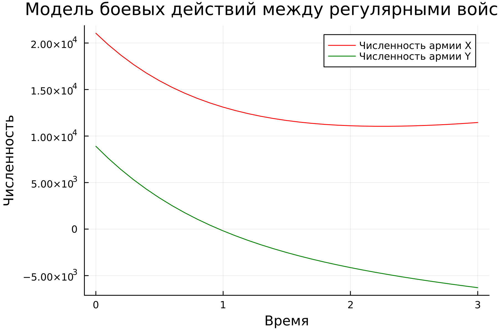
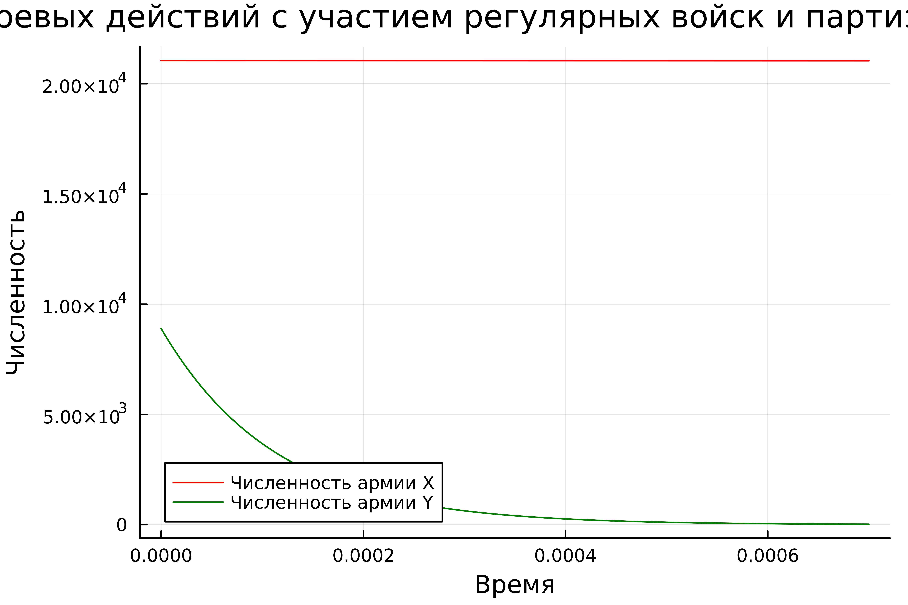
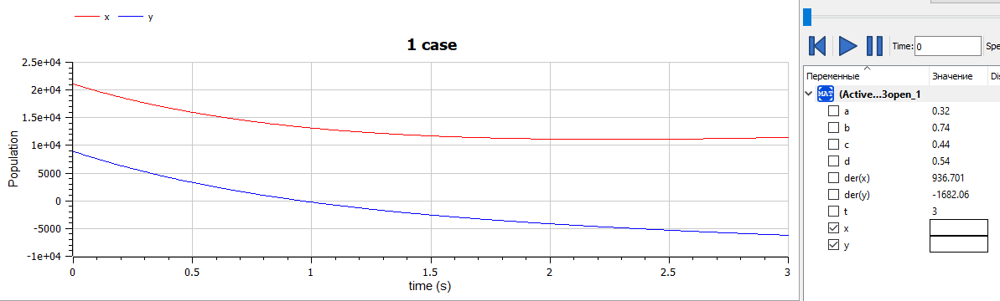
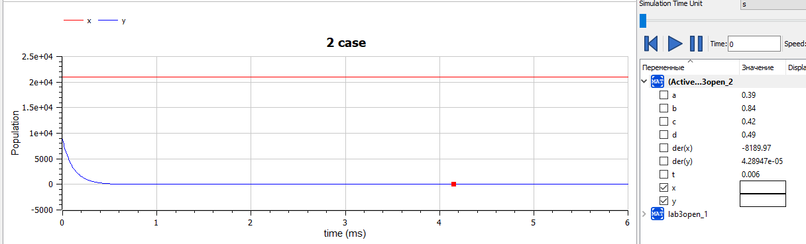

---
## Front matter
title: "Лабораторная работа №3"
subtitle: "Модель боевых действий. Вариант 39"
author: "Абдуллина Ляйсан Раисовна, НПИбд-01-21"

## Generic otions
lang: ru-RU
toc-title: "Содержание"

## Bibliography
bibliography: bib/cite.bib
csl: pandoc/csl/gost-r-7-0-5-2008-numeric.csl

## Pdf output format
toc: true # Table of contents
toc-depth: 2
lof: true # List of figures
fontsize: 12pt
linestretch: 1.5
papersize: a4
documentclass: scrreprt
## I18n polyglossia
polyglossia-lang:
  name: russian
  options:
	- spelling=modern
	- babelshorthands=true
polyglossia-otherlangs:
  name: english
## I18n babel
babel-lang: russian
babel-otherlangs: english
## Fonts
mainfont: PT Serif
romanfont: PT Serif
sansfont: PT Sans
monofont: PT Mono
mainfontoptions: Ligatures=TeX
romanfontoptions: Ligatures=TeX
sansfontoptions: Ligatures=TeX,Scale=MatchLowercase
monofontoptions: Scale=MatchLowercase,Scale=0.9
## Biblatex
biblatex: true
biblio-style: "gost-numeric"
biblatexoptions:
  - parentracker=true
  - backend=biber
  - hyperref=auto
  - language=auto
  - autolang=other*
  - citestyle=gost-numeric

## Pandoc-crossref LaTeX customization
figureTitle: "Скриншот"
tableTitle: "Таблица"
listingTitle: "Листинг"
lofTitle: "Список иллюстраций"
lotTitle: "Список таблиц"
lolTitle: "Листинги"
## Misc options
indent: true
header-includes:
  - \usepackage{indentfirst}
  - \usepackage{float} # keep figures where there are in the text
  - \floatplacement{figure}{H} # keep figures where there are in the text
---

# Цель работы

Решить задачу о модели боевых действий.

# Задачи

Рассмотреть 2 модели боя. Проверить, как работает модель в различных ситуациях, построить графики в рассматриваемых случаях. Определить победителя, найти условие при котором та или другая сторона выигрывают бой (для каждого случая).

1. Модель боевых действий между регулярными войсками

2. Модель ведение боевых действий с участием регулярных войск и партизанских отрядов 

# Теоретическое введение

Законы Ланчестера (законы Осипова — Ланчестера) — математическая формула для расчета относительных сил пары сражающихся сторон — подразделений вооруженных сил. 

Уравнения Ланчестера — это дифференциальные уравнения, описывающие зависимость между силами сражающихся сторон A и D как функцию от времени, причем функция зависит только от A и D.

# Выполнение лабораторной работы

## Условие варианта 39

Между страной Х и страной У идет война. Численность состава войск исчисляется от начала войны, и являются временными функциями x(t) и y(t). В начальный момент времени страна Х имеет армию численностью 21 050 человек, а в распоряжении страны У армия численностью в 8 900 человек. Для упрощения
модели считаем, что коэффициенты a, b, c, h постоянны. Также считаем P(t) и Q(t) непрерывные функции.
Постройте графики изменения численности войск армии Х и армии 
У для следующих случаев:

1. Модель боевых действий между регулярными войсками

 dx/dy = -0.32x(t) - 0.74y(t) + 2 |sin(t)|

 dy/dt = -0.44x(t) - 0.52y(t) + 2 |cos(t)|

2. Модель ведение боевых действий с участием регулярных войск и партизанских отрядов

 dx/dy = -0.39x(t) - 0.84y(t) + |sin(2t)|

 dy/dt = -0.42x(t)y(t) - 0.49y(t) + |cos(2t)|

## Модель боевых действий между регулярными войсками.

Зададим коэффициент смертности, не связанный с боевыми действиями у первой армии 0,32, у второй 0,44. Коэффициенты эффективности первой и второй армии 0,74 и 0,52 соответственно. Функция, описывающая подход подкрепление первой армии, P (t) = sin(t) , подкрепление второй армии описывается функцией Q(t) = cos(t).
Тогда получим следующую систему, описывающую противостояние между регулярными войсками X и Y:

 dx/dy = -0.32x(t) - 0.74y(t) + 2 * |sin(t)|

 dy/dt = -0.44x(t) - 0.52y(t) + 2 * |cos(t)|

Зададим начальные условия:
 $x_0 = 21 050$
 
 $y_0 = 8 900$

## Модель ведение боевых действий с участием регулярных войск и партизанских отрядов.

Зададим коэффициент смертности, не связанный с боевыми действиями у первой армии 0,32, у второй 0,44. Коэффициенты эффективности первой и второй армии 0,74 и 0,52 соответственно. Функция, описывающая подход подкрепление первой армии, P (t) = sin(2t) , подкрепление второй армии описывается функцией Q(t) = cos(2t).
Тогда получим следующую систему, описывающую противостояние между регулярными войсками X и Y:

 dx/dy = -0.39x(t) - 0.84y(t) + |sin(2t)|

 dy/dt = -0.42x(t)y(t) - 0.49y(t) + |cos(2t)|

Зададим начальные условия:

 $x_0 = 21 050$
 
 $y_0 = 8 900$

## Julia

Построим численное решение задачи:

using Plots
using DifferentialEquations

function one(du, u, p, t)
	du[1] = - 0.32*u[1] - 0.74*u[2] + 2*sin(t)
	du[2] = - 0.44*u[1] - 0.52*u[2] + 2*cos(t)
end

function two(du, u, p, t)
	du[1] = - 0.39*u[1] - 0.84*u[2] + sin(2*t)
	du[2] = (- 0.42*u[1] - 0.49)*u[2] + cos(2*t)
end

const people = Float64[21050, 8900]
const prom1 = [0.0, 3.0]
const prom2 = [0.0, 0.0007]

problem1 = ODEProblem(one, people, prom1)
problem2 = ODEProblem(two, people, prom2)

sol1 = solve(problem1, dtmax=0.1)
sol2 = solve(problem2, dtmax=0.000001)

A1 = [u[1] for u in sol1.u]
A2 = [u[2] for u in sol1.u]
A3 = [u[1] for u in sol2.u]
A4 = [u[2] for u in sol2.u]
T1 = [t for t in sol1.t]
T2 = [t for t in sol2.t]

plt1 = plot(dpi = 300, legend = true, bg =:white)
plot!(plt1, xlabel="Время", ylabel="Численность", title="Модель боевых действий случай 1")
plot!(plt1, T1, A1, label="Численность армии X", color =:red)
plot!(plt1, T1, A2, label="Численность армии Y", color =:green)
savefig(plt1, "lab3_1.png")

plt2 = plot(dpi = 1200, legend = true, bg =:white)
plot!(plt2, xlabel="Время", ylabel="Численность", title="Модель боевых действий случай 2")
plot!(plt2, T2, A3, label="Численность армии X", color =:red)
plot!(plt2, T2, A4, label="Численность армии Y", color =:green)
savefig(plt2, "lab3_2.png")

Получим следующие графики (Рис.1-2):

{#fig:001 width=70%}

{#fig:002 width=70%}

## OpenModelica

Построим численное решение задачи, случай 1:

model lab3open_1
Real x;
Real y;
Real a = 0.32;
Real b = 0.74;
Real c = 0.44;
Real d = 0.54;
Real t = time;
initial equation
x =21050;
y =8900;
equation
der(x) = -a*x - b*y + 2*(abs(sin(t)));
der(y) = -c*x - d*y + 2*(abs(cos(t))); 
end lab3open_1;

Построим численное решение задачи, случай 2:

model lab3open_2
Real x;
Real y;
Real a = 0.39;
Real b = 0.84;
Real c = 0.42;
Real d = 0.49;
Real t = time;
initial equation
x =21050;
y =8900;
equation
der(x) = -a*x - b*y + abs(sin(2*t));
der(y) = -c*x*y - d*y + abs(cos(2*t)); 
end lab3open_2;

{#fig:003 width=70%}

{#fig:004 width=70%}

## Анализ и сравнение результатов

Как можно заметить по графикам для первой модели, графики на Julia и OpenModelica идентичны (с поправкой на использование разных графических ресурсов, разный масштаб и т.д.).  

Аналогичная ситуация верна и для графиков противостояния регулярной армии армии партизанов, которые рассматривались во второй модели.

Армия X одержмвает победу в обоих случаях.

# Выводы

Мы смогли решить задачу о модели боевых действий, а также выполненые все поставленные задачи.
