---
## Front matter
lang: ru-RU
title: Лабораторная работа №3
subtitle: 
author:
  - Абдуллина Ляйсан Раисовна
institute:
  - Российский университет дружбы народов, Москва, Россия
date: 09 февраля 2024

babel-lang: russian
babel-otherlangs: english
mainfont: Arial
monofont: Courier New
fontsize: 12pt

## Formatting pdf
toc: false
toc-title: Содержание
slide_level: 2
aspectratio: 169
section-titles: true
theme: metropolis
header-includes:
 - \metroset{progressbar=frametitle,sectionpage=progressbar,numbering=fraction}
 - '\makeatletter'
 - '\beamer@ignorenonframefalse'
 - '\makeatother'
---

# Цель работы

Решить задачу о модели гармонических колебаний

# Задачи

1. Построить решение уравнения гармонического осциллятора без затухания 
2. Записать уравнение свободных колебаний гармонического осциллятора с затуханием, построить его решение. Построить фазовый портрет гармонических
колебаний с затуханием.
3. Записать уравнение колебаний гармонического осциллятора, если на систему действует внешняя сила, построить его решение. Построить фазовый портрет колебаний с действием внешней силы.
Примечание: Параметры $y$ и $w$ задаются самостоятельно 

# Условие варианта 39

Постройте фазовый портрет гармонического осциллятора и решение уравнения гармонического осциллятора для следующих случаев
1. Колебания гармонического осциллятора без затуханий и без действий внешней силы 

$x''+ 12x = 0$

2. Колебания гармонического осциллятора c затуханием и без действий внешней силы

$x''+ 2x' + 4.3 = 0$

3. Колебания гармонического осциллятора c затуханием и под действием внешней силы

$x''+ 7.4x' + 7.5 = 2.2cos(0.6t)$

На интервале t [0; 55] (шаг 0.05) с начальными условиями $x_0 = 0.2, igrek_0 = 0.2$

# Julia 1 случай

Получим следующие графики (Рис.1-2):

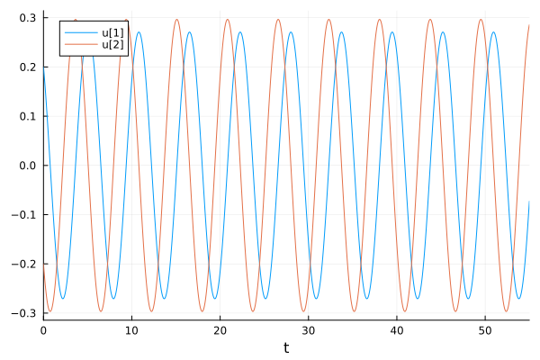{#fig:001 width=70%}

# Julia 1 случай

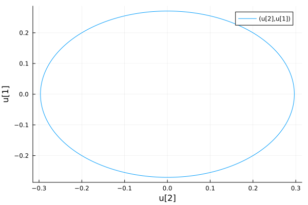{#fig:002 width=70%}

# Julia 2 случай

Получим следующие графики (Рис.3-4):

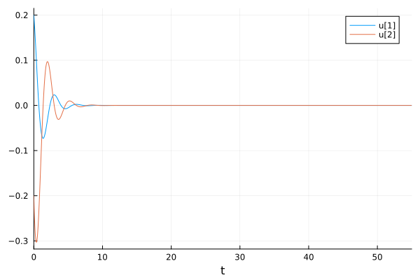{#fig:002 width=70%}

# Julia 2 случай

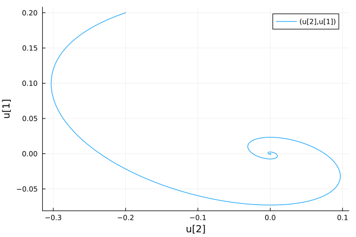{#fig:002 width=70%}

# Julia 3 случай

Получим следующие графики (Рис.5-6):

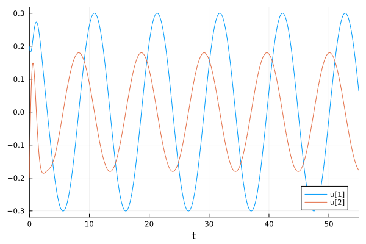{#fig:002 width=70%}

# Julia 3 случай

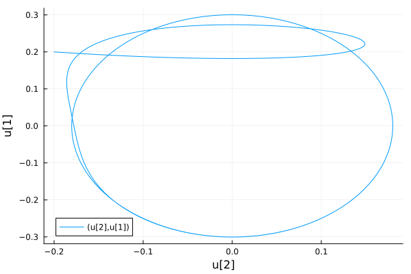{#fig:002 width=70%}

# OpenModelica 1 случай

Получим следующие графики (Рис.7-8):

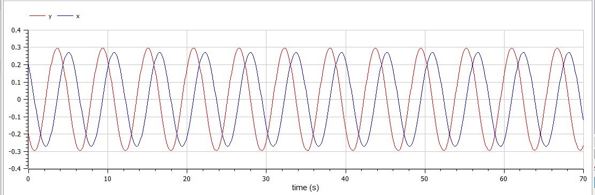{#fig:001 width=70%}

# OpenModelica 1 случай

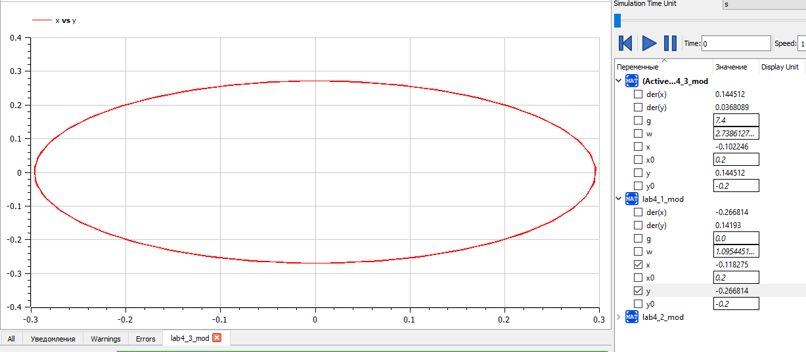{#fig:002 width=70%}

# OpenModelica 2 случай

Получим следующие графики (Рис.9-10):

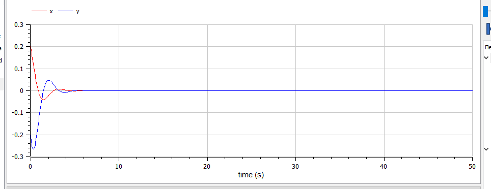{#fig:002 width=70%}

# OpenModelica 2 случай

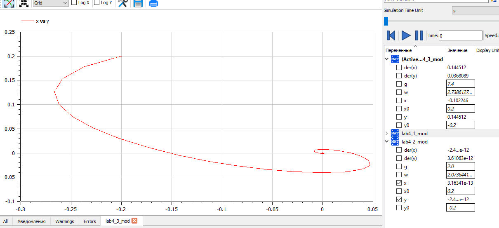{#fig:002 width=70}

# OpenModelica 3 случай

Получим следующие графики (Рис.11-12):

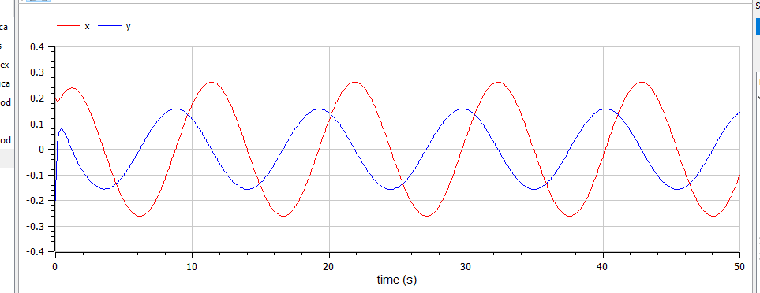{#fig:002 width=70%}

# OpenModelica 3 случай

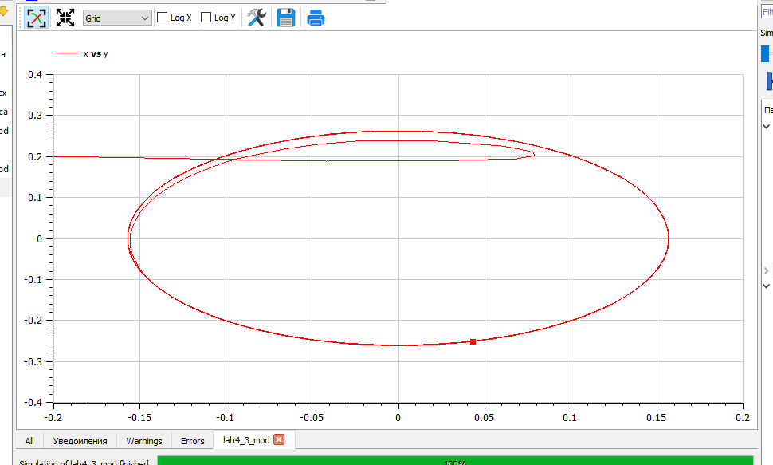{#fig:002 width=70%}

# Анализ и сравнение результатов

В ходе выполнения лабораторной работы были построены решения уравнения гармонического осциллятора и фазовые портреты гармонических колебаний без затухания, с затуханием и при действии внешней силы на языках Julia и Open Modelica.

# Выводы

Мы решили задачу о модели гармонических колебаний и выполнили всепоставленне перед нами задачи.

# Список литературы

1. Документация по Julia: https://docs.julialang.org/en/v1/

2. Документация по OpenModelica: https://openmodelica.org/

3. Решение дифференциальных уравнений: https://www.wolframalpha.com/

4. Бутиков И. Е. Собственные колебания линейного осциллятора. 2011.

