<<<<<<< HEAD
---
## Front matter
title: "Лабораторная работа №4"
subtitle: "Модель гармонических колебаний. Вариант 39"
author: "Абдуллина Ляйсан Раисовна, НПИбд-01-21"

## Generic otions
lang: ru-RU
toc-title: "Содержание"

## Bibliography
bibliography: bib/cite.bib
csl: pandoc/csl/gost-r-7-0-5-2008-numeric.csl

## Pdf output format
toc: true # Table of contents
toc-depth: 2
lof: true # List of figures
fontsize: 12pt
linestretch: 1.5
papersize: a4
documentclass: scrreprt
## I18n polyglossia
polyglossia-lang:
  name: russian
  options:
	- spelling=modern
	- babelshorthands=true
polyglossia-otherlangs:
  name: english
## I18n babel
babel-lang: russian
babel-otherlangs: english
## Fonts
mainfont: PT Serif
romanfont: PT Serif
sansfont: PT Sans
monofont: PT Mono
mainfontoptions: Ligatures=TeX
romanfontoptions: Ligatures=TeX
sansfontoptions: Ligatures=TeX,Scale=MatchLowercase
monofontoptions: Scale=MatchLowercase,Scale=0.9
## Biblatex
biblatex: true
biblio-style: "gost-numeric"
biblatexoptions:
  - parentracker=true
  - backend=biber
  - hyperref=auto
  - language=auto
  - autolang=other*
  - citestyle=gost-numeric

## Pandoc-crossref LaTeX customization
figureTitle: "Скриншот"
tableTitle: "Таблица"
listingTitle: "Листинг"
lofTitle: "Список иллюстраций"
lotTitle: "Список таблиц"
lolTitle: "Листинги"
## Misc options
indent: true
header-includes:
  - \usepackage{indentfirst}
  - \usepackage{float} # keep figures where there are in the text
  - \floatplacement{figure}{H} # keep figures where there are in the text
---

# Цель работы

Решить задачу о модели гармонических колебаний

# Задачи

1. Построить решение уравнения гармонического осциллятора без затухания 
2. Записать уравнение свободных колебаний гармонического осциллятора с затуханием, построить его решение. Построить фазовый портрет гармонических
колебаний с затуханием.
3. Записать уравнение колебаний гармонического осциллятора, если на систему действует внешняя сила, построить его решение. Построить фазовый портрет колебаний с действием внешней силы.
Примечание: Параметры $y$ и $w$ задаются самостоятельно 

# Теоретическое введение

- Гармонический осциллятор — система, которая при смещении из положения равновесия испытывает действие возвращающей силы F, пропорциональной смещению x.

- Гармоническое колебание - колебание, в процессе которого величины, характеризующие движение (смещение, скорость, ускорение и др.), изменяются по закону синуса или косинуса (гармоническому закону).

Движение грузика на пружинке, маятника, заряда в электрическом контуре, а также эволюция во времени многих систем в физике, химии, биологии и других науках при определенных предположениях можно описать одним и тем же дифференциальным уравнением, которое в теории колебаний выступает в качестве основной модели. Эта модель называется линейным гармоническим осциллятором.
Уравнение свободных колебаний гармонического осциллятора имеет следующий вид:
$x''+yx+w_0 ^2 = 0$
где $x$ - переменная, описывающая состояние системы (смещение грузика, заряд конденсатора и т.д.), $y$ - параметр, характеризующий потери энергии (трение в механической системе, сопротивление в контуре), $w_0$ - собственная частота колебаний.
Это уравнение есть линейное однородное дифференциальное  уравнение второго порядка и оно является примером линейной динамической системы.

При отсутствии потерь в системе ( $y=0$ ) получаем уравнение консервативного осциллятора энергия колебания которого сохраняется во времени.
$x''+w_0 ^2x=0$

Для однозначной разрешимости уравнения второго порядка необходимо задать два начальных условия вида
 
{
  $x(t_0) = x_0$
  $x'(t_0) = igrek_0$
}
Уравнение второго порядка можно представить в виде системы двух уравнений первого порядка:
{
  $x' = igrek$
  $igrek' = -w_0 ^2 x$
}

Начальные условия для системы примут вид:
{
  $x(t_0) = x_0$
  $y(t_0) = igrek_0$
}

Независимые	переменные	$x, y$	определяют	пространство,	в	котором «движется» решение. Это фазовое пространство системы, поскольку оно двумерно будем называть его фазовой плоскостью.

Значение фазовых координат $x, y$ в любой момент времени полностью определяет состояние системы. Решению уравнения движения как функции времени отвечает гладкая кривая в фазовой плоскости. Она называется фазовой траекторией. Если множество различных решений (соответствующих различным 
начальным условиям) изобразить на одной фазовой плоскости, возникает общая картина поведения системы. Такую картину, образованную набором фазовых траекторий, называют фазовым портретом.

# Выполнение лабораторной работы

## Условие варианта 39

Постройте фазовый портрет гармонического осциллятора и решение уравнения гармонического осциллятора для следующих случаев
1. Колебания гармонического осциллятора без затуханий и без действий внешней силы 

$x''+ 12x = 0$

2. Колебания гармонического осциллятора c затуханием и без действий внешней силы

$x''+ 2x' + 4.3 = 0$

3. Колебания гармонического осциллятора c затуханием и под действием внешней силы

$x''+ 7.4x' + 7.5 = 2.2cos(0.6t)$

На интервале t [0; 55] (шаг 0.05) с начальными условиями $x_0 = 0.2, igrek_0 = 0.2$

## Julia

Код для первого случая:

using DifferentialEquations

function lorenz!(du, u, p, t)
	a = p
	du[1] = u[2]
	du[2] = -a*u[1]
end

const x = 0.2
const y = - 0.2
u0 = [x, y]

p = (1.2)
tspan = (0.0, 55.0)
problem1 = ODEProblem(lorenz!, u0, tspan, p)
sol1 = solve(problem1, dtmax=0.05)

using Plots; gr()

plot(sol1)
savefig("lab4_1_jl.png")

plot(sol1, vars=(2,1))
savefig("lab4_1_jl_phase.png")

Получим следующие графики (Рис.1-2):

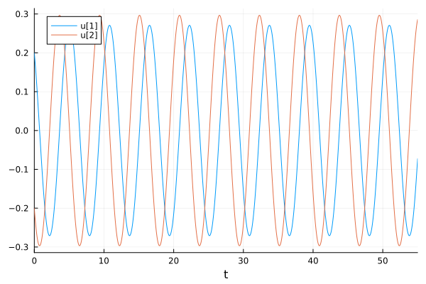{#fig:001 width=70%}

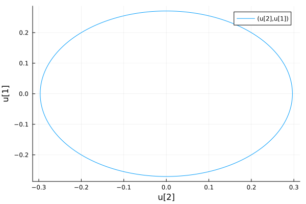{#fig:002 width=70%}

Код для второго случая:

using DifferentialEquations

function lorenz!(du, u, p, t)
	a, b = p
	du[1] = u[2]
	du[2] = -a*du[1] - b*u[1]
end

const x = 0.2
const y = - 0.2
u0 = [x, y]

p = (sqrt(2), 4.3)
tspan = (0.0, 55.0)
problem1 = ODEProblem(lorenz!, u0, tspan, p)
sol1 = solve(problem1, dtmax=0.05)

using Plots; gr()

plot(sol1)
savefig("lab4_2_jl.png")

plot(sol1, vars=(2,1))
savefig("lab4_2_jl_phase.png")

Получим следующие графики (Рис.3-4):

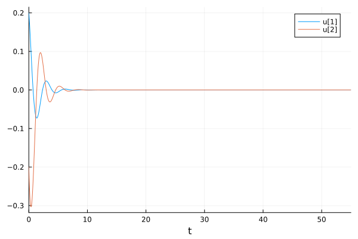{#fig:002 width=70%}

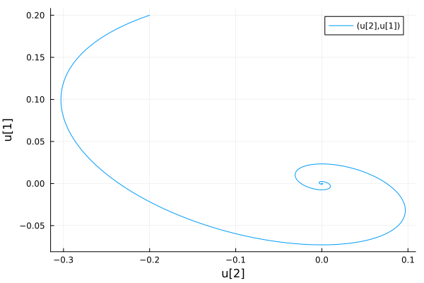{#fig:002 width=70%}

Код для третьего случая:

using DifferentialEquations

function lorenz!(du, u, p, t)
	a, b = p
	du[1] = u[2]
	du[2] = -a*du[1] - b*u[1] + 2.2*cos(0.6*t)
end

const x = 0.2
const y = - 0.2
u0 = [x, y]

p = (sqrt(7.4), 7.5)
tspan = (0.0, 55.0)
problem1 = ODEProblem(lorenz!, u0, tspan, p)
sol1 = solve(problem1, dtmax=0.05)

using Plots; gr()

plot(sol1)
savefig("lab4_3_jl.png")

plot(sol1, vars=(2,1))
savefig("lab4_3_jl_phase.png")

Получим следующие графики (Рис.5-6):

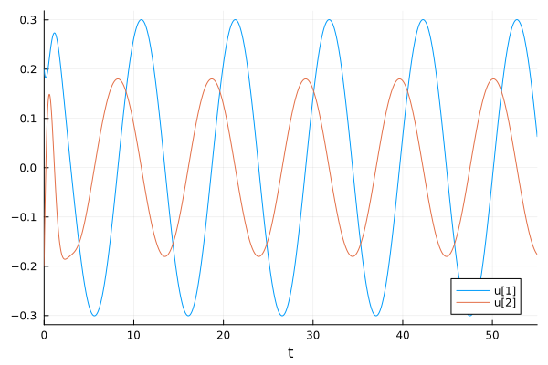{#fig:002 width=70%}

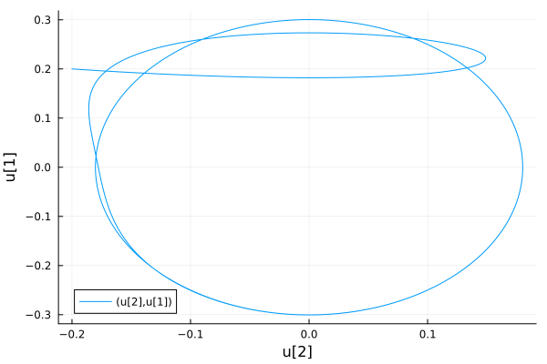{#fig:002 width=70%}

## OpenModelica

Код для первого случая:

model lab4_1_mod
parameter Real w = sqrt(1.20);
parameter Real g = 0;

parameter Real x0 = 0.2;
parameter Real y0 = -0.2;

Real x(start=x0);
Real y(start=y0);

function f 
input Real t;
output Real res;
algorithm
res:= 0;
end f;

equation
der(x) = y;
der(y) = -w*w*x - g*y + f(time);

end lab4_1_mod;

Получим следующие графики (Рис.7-8):

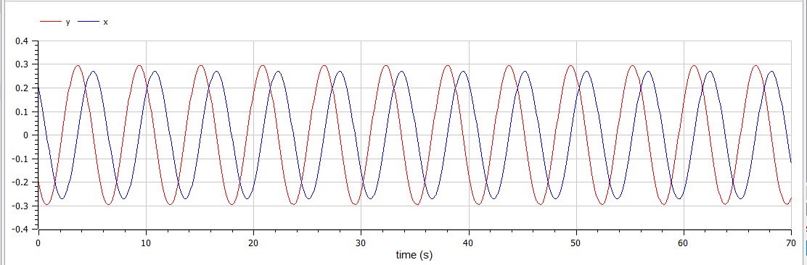{#fig:001 width=70%}

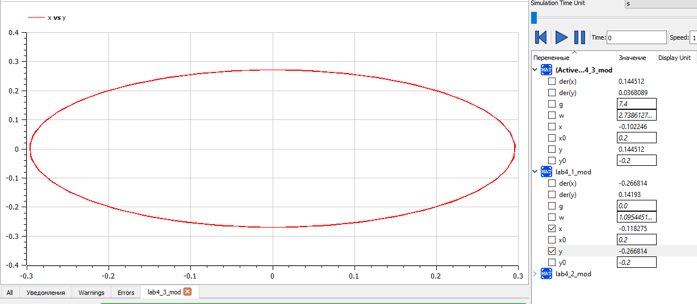{#fig:002 width=70%}

Код для второго случая:

model lab4_2_mod
parameter Real w = sqrt(4.3);
parameter Real g = 2;

parameter Real x0 = 0.2;
parameter Real y0 = -0.2;

Real x(start=x0);
Real y(start=y0);

function f 
input Real t;
output Real res;
algorithm
res:= 0;
end f;

equation
der(x) = y;
der(y) = -w*w*x - g*y + f(time);

end lab4_2_mod;

Получим следующие графики (Рис.9-10):

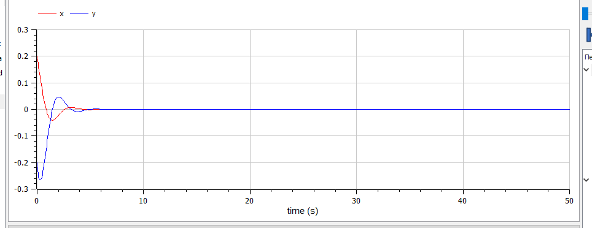{#fig:002 width=70%}

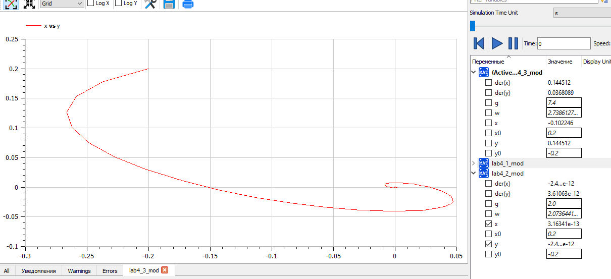{#fig:002 width=70}

Код для третьего случая:

model lab4_3_mod
parameter Real w = sqrt(7.5);
parameter Real g = 7.4;

parameter Real x0 = 0.2;
parameter Real y0 = -0.2;

Real x(start=x0);
Real y(start=y0);

function f 
input Real t;
output Real res;
algorithm
res:= 2.2*cos(0.6*t);
end f;

equation
der(x) = y;
der(y) = -w*w*x - g*y + f(time);

end lab4_3_mod;

Получим следующие графики (Рис.11-12):

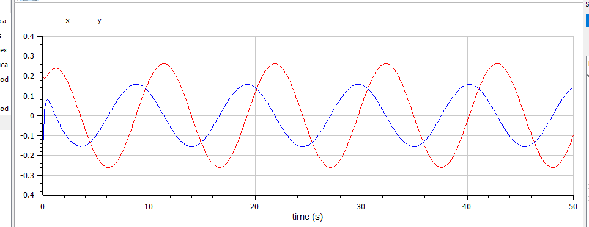{#fig:002 width=70%}

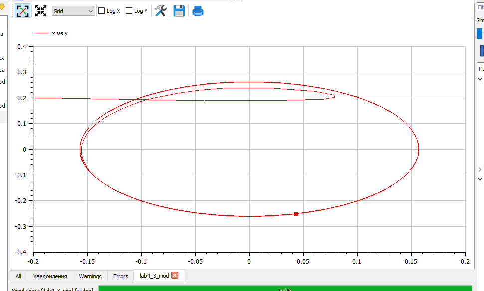{#fig:002 width=70%}

## Анализ и сравнение результатов

В ходе выполнения лабораторной работы были построены решения уравнения гармонического осциллятора и фазовые портреты гармонических колебаний без затухания, с затуханием и при действии внешней силы на языках Julia и Open Modelica.

# Выводы

Мы решили задачу о модели гармонических колебаний и выполнили всепоставленне перед нами задачи.

# Список литературы

1. Документация по Julia: https://docs.julialang.org/en/v1/

2. Документация по OpenModelica: https://openmodelica.org/

3. Решение дифференциальных уравнений: https://www.wolframalpha.com/

4. Бутиков И. Е. Собственные колебания линейного осциллятора. 2011.
=======
---
## Front matter
title: "Лабораторная работа №4"
subtitle: "Модель гармонических колебаний. Вариант 39"
author: "Абдуллина Ляйсан Раисовна, НПИбд-01-21"

## Generic otions
lang: ru-RU
toc-title: "Содержание"

## Bibliography
bibliography: bib/cite.bib
csl: pandoc/csl/gost-r-7-0-5-2008-numeric.csl

## Pdf output format
toc: true # Table of contents
toc-depth: 2
lof: true # List of figures
fontsize: 12pt
linestretch: 1.5
papersize: a4
documentclass: scrreprt
## I18n polyglossia
polyglossia-lang:
  name: russian
  options:
	- spelling=modern
	- babelshorthands=true
polyglossia-otherlangs:
  name: english
## I18n babel
babel-lang: russian
babel-otherlangs: english
## Fonts
mainfont: PT Serif
romanfont: PT Serif
sansfont: PT Sans
monofont: PT Mono
mainfontoptions: Ligatures=TeX
romanfontoptions: Ligatures=TeX
sansfontoptions: Ligatures=TeX,Scale=MatchLowercase
monofontoptions: Scale=MatchLowercase,Scale=0.9
## Biblatex
biblatex: true
biblio-style: "gost-numeric"
biblatexoptions:
  - parentracker=true
  - backend=biber
  - hyperref=auto
  - language=auto
  - autolang=other*
  - citestyle=gost-numeric

## Pandoc-crossref LaTeX customization
figureTitle: "Скриншот"
tableTitle: "Таблица"
listingTitle: "Листинг"
lofTitle: "Список иллюстраций"
lotTitle: "Список таблиц"
lolTitle: "Листинги"
## Misc options
indent: true
header-includes:
  - \usepackage{indentfirst}
  - \usepackage{float} # keep figures where there are in the text
  - \floatplacement{figure}{H} # keep figures where there are in the text
---

# Цель работы

Решить задачу о модели гармонических колебаний

# Задачи

1. Построить решение уравнения гармонического осциллятора без затухания 
2. Записать уравнение свободных колебаний гармонического осциллятора с затуханием, построить его решение. Построить фазовый портрет гармонических
колебаний с затуханием.
3. Записать уравнение колебаний гармонического осциллятора, если на систему действует внешняя сила, построить его решение. Построить фазовый портрет колебаний с действием внешней силы.
Примечание: Параметры $y$ и $w$ задаются самостоятельно 

# Теоретическое введение

- Гармонический осциллятор — система, которая при смещении из положения равновесия испытывает действие возвращающей силы F, пропорциональной смещению x.

- Гармоническое колебание - колебание, в процессе которого величины, характеризующие движение (смещение, скорость, ускорение и др.), изменяются по закону синуса или косинуса (гармоническому закону).

Движение грузика на пружинке, маятника, заряда в электрическом контуре, а также эволюция во времени многих систем в физике, химии, биологии и других науках при определенных предположениях можно описать одним и тем же дифференциальным уравнением, которое в теории колебаний выступает в качестве основной модели. Эта модель называется линейным гармоническим осциллятором.
Уравнение свободных колебаний гармонического осциллятора имеет следующий вид:
$x''+yx+w_0 ^2 = 0$
где $x$ - переменная, описывающая состояние системы (смещение грузика, заряд конденсатора и т.д.), $y$ - параметр, характеризующий потери энергии (трение в механической системе, сопротивление в контуре), $w_0$ - собственная частота колебаний.
Это уравнение есть линейное однородное дифференциальное  уравнение второго порядка и оно является примером линейной динамической системы.

При отсутствии потерь в системе ( $y=0$ ) получаем уравнение консервативного осциллятора энергия колебания которого сохраняется во времени.
$x''+w_0 ^2x=0$

Для однозначной разрешимости уравнения второго порядка необходимо задать два начальных условия вида
 
{
  $x(t_0) = x_0$
  $x'(t_0) = igrek_0$
}
Уравнение второго порядка можно представить в виде системы двух уравнений первого порядка:
{
  $x' = igrek$
  $igrek' = -w_0 ^2 x$
}

Начальные условия для системы примут вид:
{
  $x(t_0) = x_0$
  $y(t_0) = igrek_0$
}

Независимые	переменные	$x, y$	определяют	пространство,	в	котором «движется» решение. Это фазовое пространство системы, поскольку оно двумерно будем называть его фазовой плоскостью.

Значение фазовых координат $x, y$ в любой момент времени полностью определяет состояние системы. Решению уравнения движения как функции времени отвечает гладкая кривая в фазовой плоскости. Она называется фазовой траекторией. Если множество различных решений (соответствующих различным 
начальным условиям) изобразить на одной фазовой плоскости, возникает общая картина поведения системы. Такую картину, образованную набором фазовых траекторий, называют фазовым портретом.

# Выполнение лабораторной работы

## Условие варианта 39

Постройте фазовый портрет гармонического осциллятора и решение уравнения гармонического осциллятора для следующих случаев
1. Колебания гармонического осциллятора без затуханий и без действий внешней силы 

$x''+ 12x = 0$

2. Колебания гармонического осциллятора c затуханием и без действий внешней силы

$x''+ 2x' + 4.3 = 0$

3. Колебания гармонического осциллятора c затуханием и под действием внешней силы

$x''+ 7.4x' + 7.5 = 2.2cos(0.6t)$

На интервале t [0; 55] (шаг 0.05) с начальными условиями $x_0 = 0.2, igrek_0 = 0.2$

## Julia

Код для первого случая:

using DifferentialEquations

function lorenz!(du, u, p, t)
	a = p
	du[1] = u[2]
	du[2] = -a*u[1]
end

const x = 0.2
const y = - 0.2
u0 = [x, y]

p = (1.2)
tspan = (0.0, 55.0)
problem1 = ODEProblem(lorenz!, u0, tspan, p)
sol1 = solve(problem1, dtmax=0.05)

using Plots; gr()

plot(sol1)
savefig("lab4_1_jl.png")

plot(sol1, vars=(2,1))
savefig("lab4_1_jl_phase.png")

Получим следующие графики (Рис.1-2):

{#fig:001 width=70%}

{#fig:002 width=70%}

Код для второго случая:

using DifferentialEquations

function lorenz!(du, u, p, t)
	a, b = p
	du[1] = u[2]
	du[2] = -a*du[1] - b*u[1]
end

const x = 0.2
const y = - 0.2
u0 = [x, y]

p = (sqrt(2), 4.3)
tspan = (0.0, 55.0)
problem1 = ODEProblem(lorenz!, u0, tspan, p)
sol1 = solve(problem1, dtmax=0.05)

using Plots; gr()

plot(sol1)
savefig("lab4_2_jl.png")

plot(sol1, vars=(2,1))
savefig("lab4_2_jl_phase.png")

Получим следующие графики (Рис.3-4):

{#fig:002 width=70%}

{#fig:002 width=70%}

Код для третьего случая:

using DifferentialEquations

function lorenz!(du, u, p, t)
	a, b = p
	du[1] = u[2]
	du[2] = -a*du[1] - b*u[1] + 2.2*cos(0.6*t)
end

const x = 0.2
const y = - 0.2
u0 = [x, y]

p = (sqrt(7.4), 7.5)
tspan = (0.0, 55.0)
problem1 = ODEProblem(lorenz!, u0, tspan, p)
sol1 = solve(problem1, dtmax=0.05)

using Plots; gr()

plot(sol1)
savefig("lab4_3_jl.png")

plot(sol1, vars=(2,1))
savefig("lab4_3_jl_phase.png")

Получим следующие графики (Рис.5-6):

{#fig:002 width=70%}

{#fig:002 width=70%}

## OpenModelica

Код для первого случая:

model lab4_1_mod
parameter Real w = sqrt(1.20);
parameter Real g = 0;

parameter Real x0 = 0.2;
parameter Real y0 = -0.2;

Real x(start=x0);
Real y(start=y0);

function f 
input Real t;
output Real res;
algorithm
res:= 0;
end f;

equation
der(x) = y;
der(y) = -w*w*x - g*y + f(time);

end lab4_1_mod;

Получим следующие графики (Рис.7-8):

{#fig:001 width=70%}

{#fig:002 width=70%}

Код для второго случая:

model lab4_2_mod
parameter Real w = sqrt(4.3);
parameter Real g = 2;

parameter Real x0 = 0.2;
parameter Real y0 = -0.2;

Real x(start=x0);
Real y(start=y0);

function f 
input Real t;
output Real res;
algorithm
res:= 0;
end f;

equation
der(x) = y;
der(y) = -w*w*x - g*y + f(time);

end lab4_2_mod;

Получим следующие графики (Рис.9-10):

{#fig:002 width=70%}

{#fig:002 width=70}

Код для третьего случая:

model lab4_3_mod
parameter Real w = sqrt(7.5);
parameter Real g = 7.4;

parameter Real x0 = 0.2;
parameter Real y0 = -0.2;

Real x(start=x0);
Real y(start=y0);

function f 
input Real t;
output Real res;
algorithm
res:= 2.2*cos(0.6*t);
end f;

equation
der(x) = y;
der(y) = -w*w*x - g*y + f(time);

end lab4_3_mod;

Получим следующие графики (Рис.11-12):

{#fig:002 width=70%}

{#fig:002 width=70%}

## Анализ и сравнение результатов

В ходе выполнения лабораторной работы были построены решения уравнения гармонического осциллятора и фазовые портреты гармонических колебаний без затухания, с затуханием и при действии внешней силы на языках Julia и Open Modelica.

# Выводы

Мы решили задачу о модели гармонических колебаний и выполнили всепоставленне перед нами задачи.

# Список литературы

1. Документация по Julia: https://docs.julialang.org/en/v1/

2. Документация по OpenModelica: https://openmodelica.org/

3. Решение дифференциальных уравнений: https://www.wolframalpha.com/

4. Бутиков И. Е. Собственные колебания линейного осциллятора. 2011.
>>>>>>> de430d5c6ed1099e8262bdd31b93ae1913dd7130
