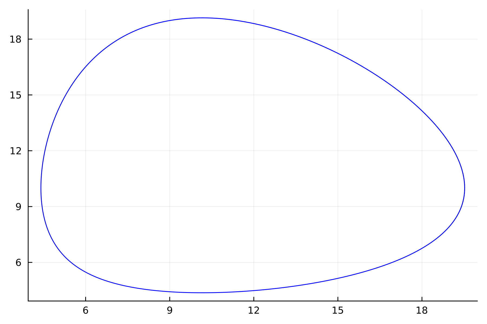
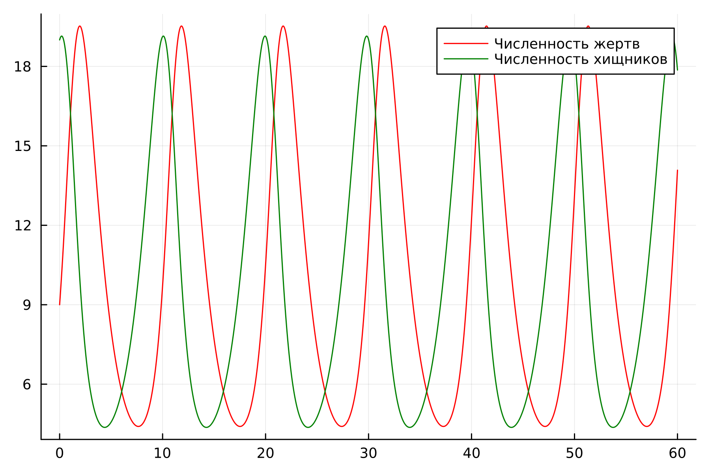
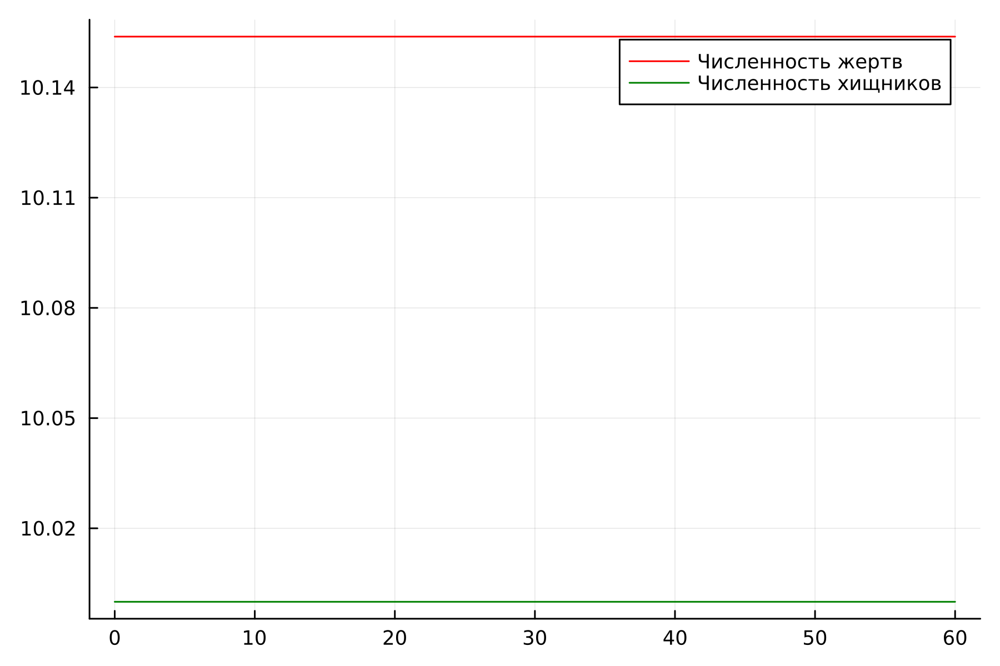
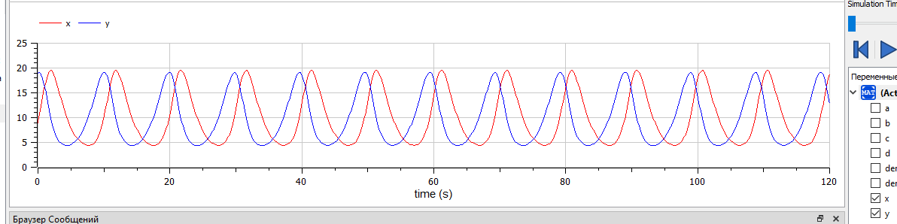
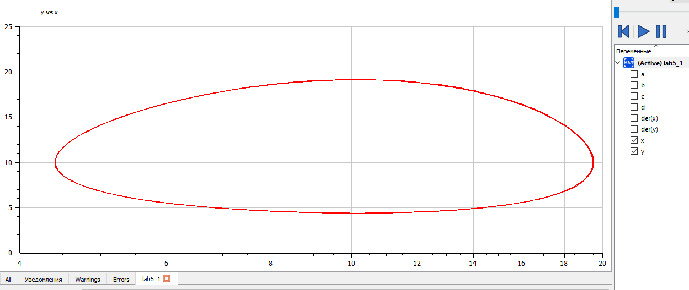
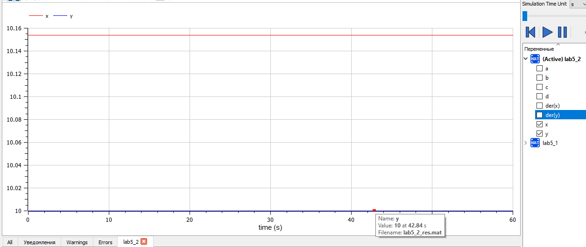

---
## Front matter
lang: ru-RU
title: Лабораторная работа №5
subtitle: 
author:
  - Абдуллина Ляйсан Раисовна
institute:
  - Российский университет дружбы народов, Москва, Россия
date: 03 марта 2024

babel-lang: russian
babel-otherlangs: english
mainfont: Arial
monofont: Courier New
fontsize: 12pt

## Formatting pdf
toc: false
toc-title: Содержание
slide_level: 2
aspectratio: 169
section-titles: true
theme: metropolis
header-includes:
 - \metroset{progressbar=frametitle,sectionpage=progressbar,numbering=fraction}
 - '\makeatletter'
 - '\beamer@ignorenonframefalse'
 - '\makeatother'
---

# Цель работы

Решить задачу о модели хищник-жертва.

# Задачи

1. Постройте график зависимости численности хищников от численности жертв
2. Постройте графики изменения численности хищников и численности жертв при заданных начальных условиях. 
3. Найдите стационарное состояние системы.

# Условие варианта 39

Для модели «хищник-жертва»:

{
  $dx/dt = -0.67x(t) + 0.067x(t)y(t)$

  $dy/dt = 0.66y(t) - 0.065x(t)y(t)$
}

# Условие варианта 39

Постройте график зависимости численности хищников от численности жертв, а также графики изменения численности хищников и численности жертв при следующих начальных условиях: $x_0 = 9$, $y_0=19$. Найдите стационарное
состояние системы.

# Julia

Решение для нестацианарного состояния системы:

Получим следующие графики (Рис.1-2):

{#fig:001 width=70%}

# Julia

{#fig:002 width=70%}

# Julia
Решение для стационарного состояния системы: 
Для стационарного состояния y(x) = smthfunction решение будет представять из себя точку.

Получим следующие графики (Рис.3):

# Julia

{#fig:002 width=70%}

# OpenModelica

Решение для нестацианарного состояния системы:

Получим следующие графики (Рис.4-5):

{#fig:004 width=70%}

# OpenModelica

{#fig:005 width=70%}

Решение для стацианарного состояния системы:
Для стационарного состояния y(x) = smthfunction решение будет представять из себя точку.
Получим следующие графики (Рис.6):

# OpenModelica

{#fig:006 width=70%}

# Анализ и сравнение результатов

В ходе выполнения лабораторной работы были построены графики зависимости численности хищников от численности жертв и изменения численности хищников и численности жертв при заданных начальных условиях, а также найдено стационарное состояние системы. на языках Julia и с помощью ПО Open Modelica. Результаты графикв совпадают (не учитываю  разности в масштабах).

# Выводы

Мы решили задачу о модели Хищник-Жертва и выполнили все поставленне перед нами задачи.

# Список литературы

1. Документация по Julia: https://docs.julialang.org/en/v1/

2. Документация по OpenModelica: https://openmodelica.org/

3. Решение дифференциальных уравнений: https://www.wolframalpha.com/
