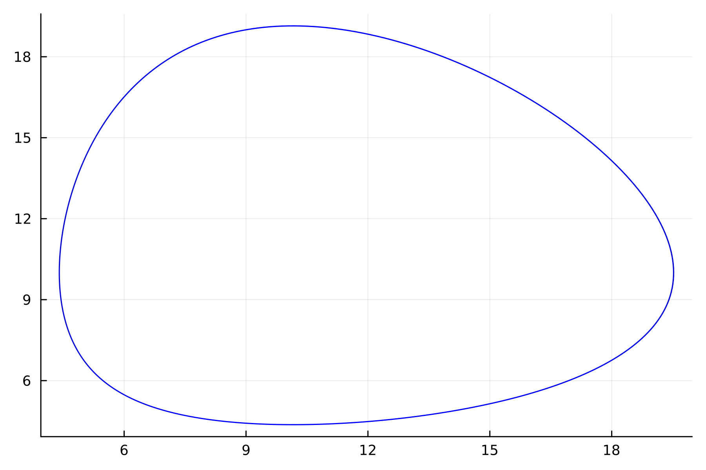
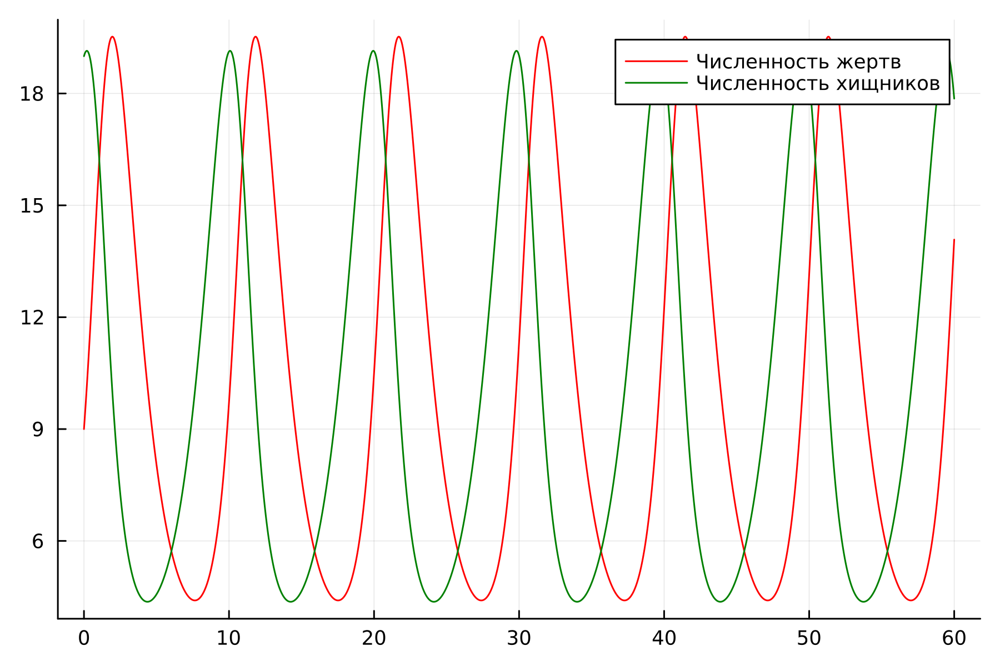
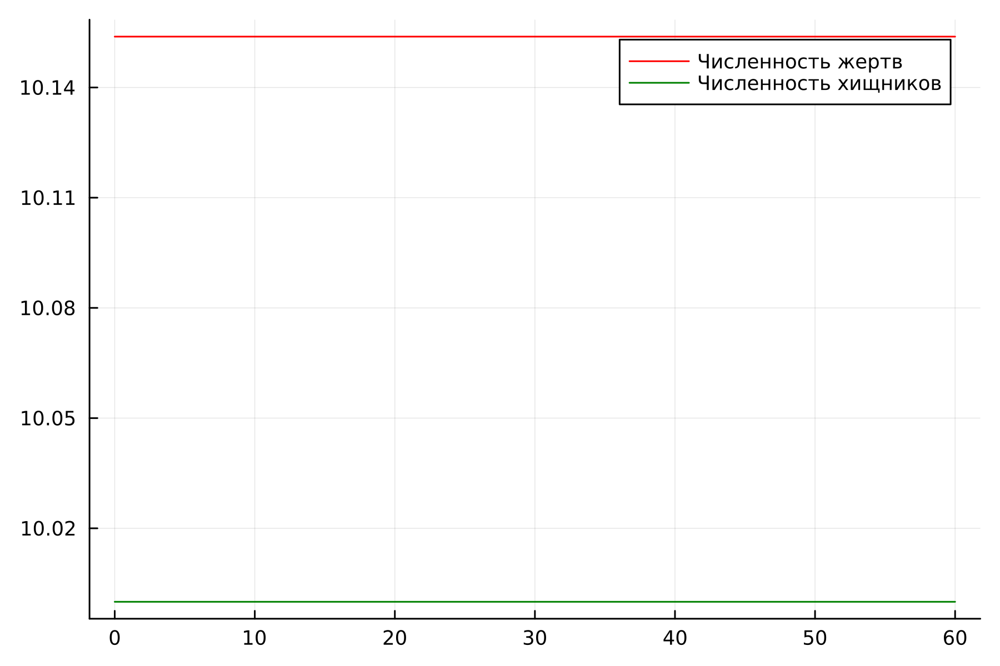
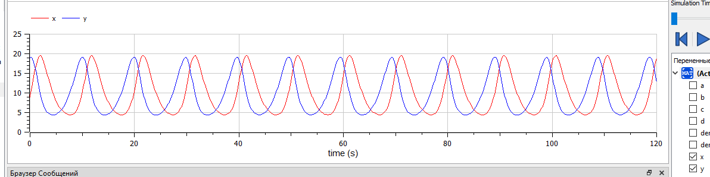
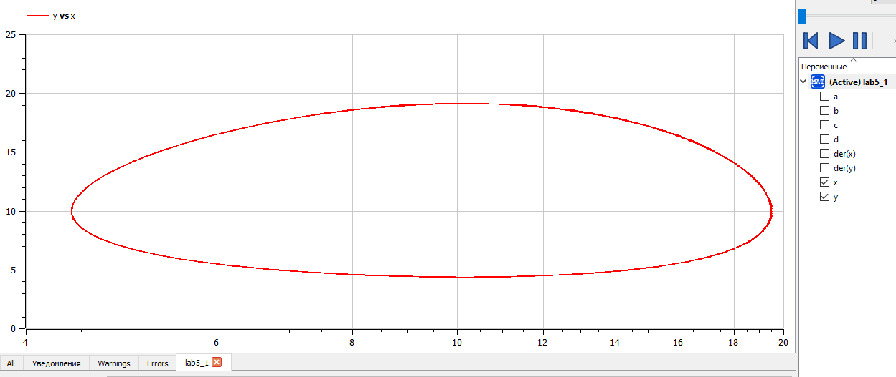
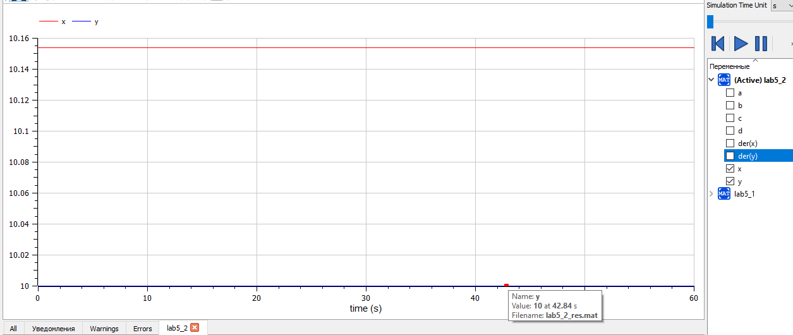

---
## Front matter
title: "Лабораторная работа №5"
subtitle: "Модель хищник-жертва. Вариант 39"
author: "Абдуллина Ляйсан Раисовна, НПИбд-01-21"

## Generic otions
lang: ru-RU
toc-title: "Содержание"

## Bibliography
bibliography: bib/cite.bib
csl: pandoc/csl/gost-r-7-0-5-2008-numeric.csl

## Pdf output format
toc: true # Table of contents
toc-depth: 2
lof: true # List of figures
fontsize: 12pt
linestretch: 1.5
papersize: a4
documentclass: scrreprt
## I18n polyglossia
polyglossia-lang:
  name: russian
  options:
	- spelling=modern
	- babelshorthands=true
polyglossia-otherlangs:
  name: english
## I18n babel
babel-lang: russian
babel-otherlangs: english
## Fonts
mainfont: PT Serif
romanfont: PT Serif
sansfont: PT Sans
monofont: PT Mono
mainfontoptions: Ligatures=TeX
romanfontoptions: Ligatures=TeX
sansfontoptions: Ligatures=TeX,Scale=MatchLowercase
monofontoptions: Scale=MatchLowercase,Scale=0.9
## Biblatex
biblatex: true
biblio-style: "gost-numeric"
biblatexoptions:
  - parentracker=true
  - backend=biber
  - hyperref=auto
  - language=auto
  - autolang=other*
  - citestyle=gost-numeric

## Pandoc-crossref LaTeX customization
figureTitle: "Скриншот"
tableTitle: "Таблица"
listingTitle: "Листинг"
lofTitle: "Список иллюстраций"
lotTitle: "Список таблиц"
lolTitle: "Листинги"
## Misc options
indent: true
header-includes:
  - \usepackage{indentfirst}
  - \usepackage{float} # keep figures where there are in the text
  - \floatplacement{figure}{H} # keep figures where there are in the text
---

# Цель работы

Решить задачу о модели хищник-жертва.

# Задачи

1. Постройте график зависимости численности хищников от численности жертв
2. Постройте графики изменения численности хищников и численности жертв при заданных начальных условиях. 
3. Найдите стационарное состояние системы.

# Теоретическое введение

Простейшая модель взаимодействия двух видов типа «хищник — жертва» - модель Лотки-Вольтерры. Данная двувидовая модель основывается на следующих предположениях:
1. Численность популяции жертв x и хищников y зависят только от времени (модель не учитывает пространственное распределение популяции на занимаемой территории)
2. В отсутствии взаимодействия численность видов изменяется по модели Мальтуса, при этом число жертв увеличивается, а число хищников падает
3. Естественная смертность жертвы и естественная рождаемость хищника считаются несущественными
4. Эффект насыщения численности обеих популяций не учитывается
5. Скорость роста численности жертв уменьшается пропорционально
численности хищников

{
  $dx/dt = ax(t) -bx(t)y(t)$

  $dy/dt = -cy(t) - dx(t)y(t)$
}

В этой модели x – число жертв, y - число хищников. Коэффициент a описывает скорость естественного прироста числа жертв в отсутствие хищников, с - естественное вымирание хищников, лишенных пищи в виде жертв. Вероятность взаимодействия жертвы и хищника считается пропорциональной как количеству жертв, так и числу самих хищников (xy). Каждый акт взаимодействия уменьшает популяцию жертв, но способствует увеличению популяции хищников (члены -bxy и dxy в правой части уравнения). 

# Выполнение лабораторной работы

## Условие варианта 39

Для модели «хищник-жертва»:

{
  $dx/dt = -0.67x(t) + 0.067x(t)y(t)$

  $dy/dt = 0.66y(t) - 0.065x(t)y(t)$
}

Постройте график зависимости численности хищников от численности жертв, а также графики изменения численности хищников и численности жертв при следующих начальных условиях: $x_0 = 9$, $y_0=19$. Найдите стационарное
состояние системы.

## Julia

Код для нестацианарного состояния системы:

using DifferentialEquations
using Plots

x0 = 9
y0 = 19

a = 0.67
b = 0.067
c = 0.66
d = 0.065

function ode_fn(du, u, p, t)
	x, y = u
	du[1] = -a*u[1] + b*u[1] * u[2]
	du[2] = c*u[2] - d*u[1]* u[2]
end

v0 = [x0, y0]
tspan = (0.0, 60.0)
prob = ODEProblem(ode_fn, v0, tspan)
sol = solve(prob, dtmax=0.05)
X = [u[1] for u in sol.u]
Y = [u[2] for u in sol.u]
T = [t for t in sol.t]

plt = plot(dpi=300, legend = false)
plot!(plt, X, Y, color=:blue)
savefig(plt,"lab5_1_jl.png")

plt2 = plot(dpi=300, legend = true)
plot!(plt2, T, X, label = "Численность жертв" ,color=:red)

plot!(plt2, T, Y, label = "Численность хищников" ,color=:green)
savefig(plt,"lab5_2_jl.png")

Получим следующие графики (Рис.1-2):

{#fig:001 width=70%}

{#fig:002 width=70%}

Код для стацианарного состояния системы:

using DifferentialEquations
using Plots

a = 0.67
b = 0.067
c = 0.66
d = 0.065

x0 = c/d
y0 = a/b

function ode_fn(du, u, p, t)
	x, y = u
	du[1] = -a*u[1] + b*u[1] * u[2]
	du[2] = c*u[2] - d*u[1]* u[2]
end

v0 = [x0, y0]
tspan = (0.0, 60.0)
prob = ODEProblem(ode_fn, v0, tspan)
sol = solve(prob, dtmax=0.05)
X = [u[1] for u in sol.u]
Y = [u[2] for u in sol.u]
T = [t for t in sol.t]

plt2 = plot(dpi=300, legend = true)
plot!(plt2, T, X, label = "Численность жертв" ,color=:red)
plot!(plt2, T, Y, label = "Численность хищников" ,color=:green)
savefig(plt2,"lab5_3_jl.png")

Для стационарного состояния y(x) = smthfunction решение будет представять из себя точку.

Получим следующие графики (Рис.3):

{#fig:002 width=70%}

## OpenModelica

Код для нестацианарного состояния системы:

model lab5_1
Real a = 0.67;
Real b = 0.067;
Real c = 0.66;
Real d = 0.065;

Real x;
Real y;

initial equation
x = 9;
y = 19;
equation

der(x) = -a*x+b*x*y;
der(y) = c*y-d*x*y;

end lab5_1;

Получим следующие графики (Рис.4-5):

{#fig:004 width=70%}

{#fig:005 width=70%}

Код для стацианарного состояния системы:

model lab5_2
Real a = 0.67;
Real b = 0.067;
Real c = 0.66;
Real d = 0.065;

Real x;
Real y;

initial equation
x = c/d;
y = a/b;
equation

der(x) = -a*x+b*x*y;
der(y) = c*y-d*x*y;

end lab5_2;

Для стационарного состояния y(x) = smthfunction решение будет представять из себя точку.

Получим следующие графики (Рис.6):

{#fig:006 width=70%}

## Анализ и сравнение результатов

В ходе выполнения лабораторной работы были построены графики зависимости численности хищников от численности жертв и изменения численности хищников и численности жертв при заданных начальных условиях, а также найдено стационарное состояние системы. на языках Julia и с помощью ПО Open Modelica. Результаты графикв совпадают (не учитываю  разности в масштабах).

# Выводы

Мы решили задачу о модели Хищник-Жертва и выполнили все поставленне перед нами задачи.

# Список литературы

1. Документация по Julia: https://docs.julialang.org/en/v1/

2. Документация по OpenModelica: https://openmodelica.org/

3. Решение дифференциальных уравнений: https://www.wolframalpha.com/

