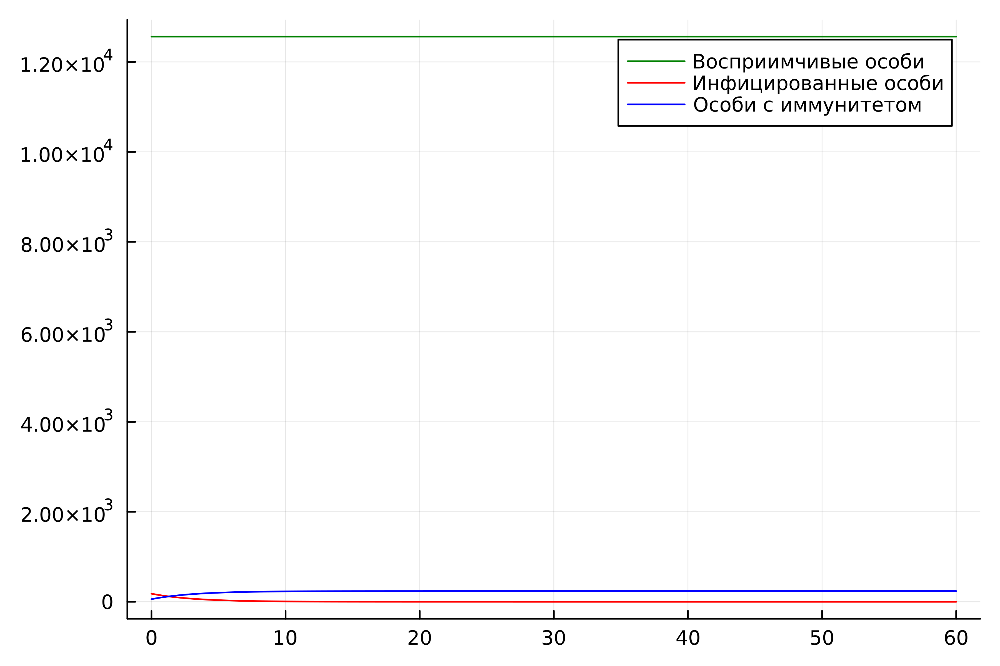
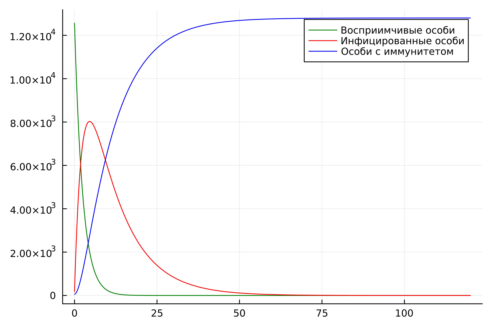
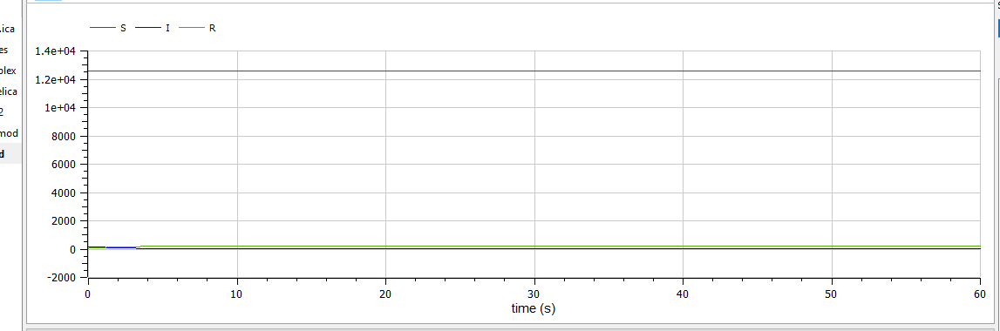
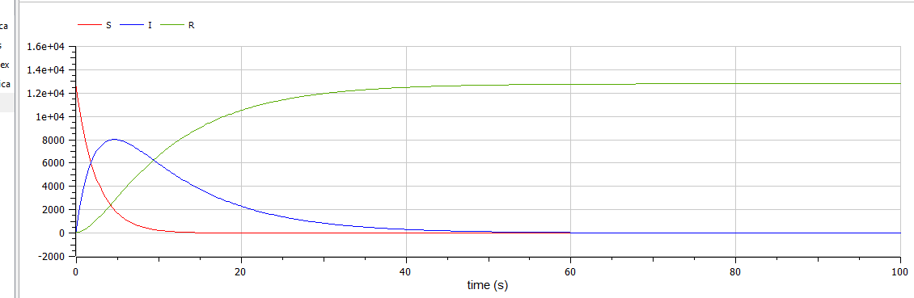

---
## Front matter
lang: ru-RU
title: Лабораторная работа №6
subtitle: 
author:
  - Абдуллина Ляйсан Раисовна
institute:
  - Российский университет дружбы народов, Москва, Россия
date: 11 марта 2024

babel-lang: russian
babel-otherlangs: english
mainfont: Arial
monofont: Courier New
fontsize: 12pt

## Formatting pdf
toc: false
toc-title: Содержание
slide_level: 2
aspectratio: 169
section-titles: true
theme: metropolis
header-includes:
 - \metroset{progressbar=frametitle,sectionpage=progressbar,numbering=fraction}
 - '\makeatletter'
 - '\beamer@ignorenonframefalse'
 - '\makeatother'
---

# Цель работы

Решить задачу об эпидемии.

## Задачи

1. Постройте графики изменения числа особей в каждой из трех групп.

# Условие варианта 39

На одном острове вспыхнула эпидемия. Известно, что из всех проживающих на острове (N=12 800) в момент начала эпидемии (t=0) число заболевших людей (являющихся распространителями инфекции) I(0)=180, А число здоровых людей с иммунитетом к болезни R(0)=58. Таким образом, число людей восприимчивых к болезни, но пока здоровых, в начальный момент времени S(0)=N-I(0)- R(0).

# Условие варианта 39

Постройте графики изменения числа особей в каждой из трех групп.
Рассмотрите, как будет протекать эпидемия в случае: 
1) если I(0) <= $I^*$
2) если I(0) > $I^*$

# Julia

Для I(0) <= $I^*$ получим следующий график (Рис.1):

{#fig:001 width=70%}

# Julia

Для I(0) > $I^*$ получим следующий график (Рис.2):

{#fig:002 width=70%}

# OpenModelica

Для I(0) <= $I^*$ получим следующий график (Рис.1):

{#fig:003 width=70%}

# OpenModelica

Для I(0) > $I^*$ получим следующий график (Рис.2):

{#fig:004 width=70%}

# Анализ и сравнение результатов

В ходе выполнения лабораторной работы были построены графики изменения числа особей в каждой из трех груп при заданных начальных условиях на языках Julia и с помощью ПО Open Modelica. Результаты графиков совпадают (не учитывая  разности в масштабах).

# Выводы

Мы решили задачу  об эпидемии. и выполнили все поставленне перед нами задачи.

# Список литературы

1. Документация по Julia: https://docs.julialang.org/en/v1/

2. Документация по OpenModelica: https://openmodelica.org/

3. Решение дифференциальных уравнений: https://www.wolframalpha.com/

