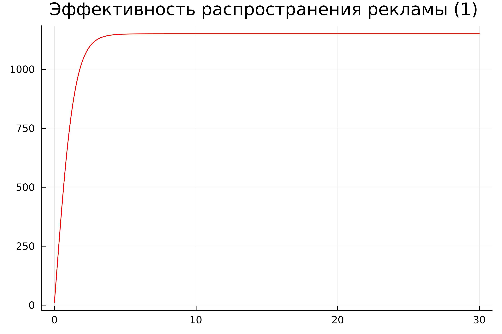
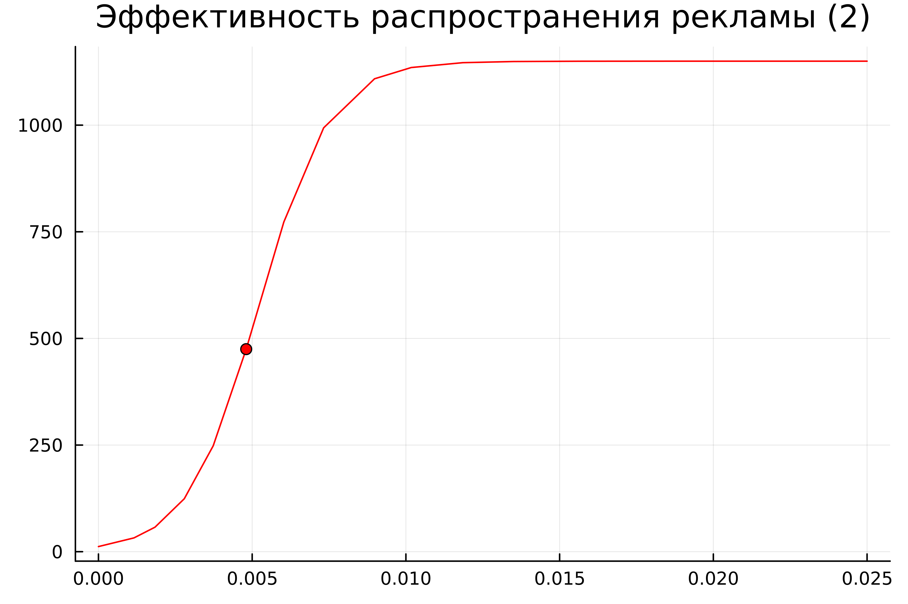
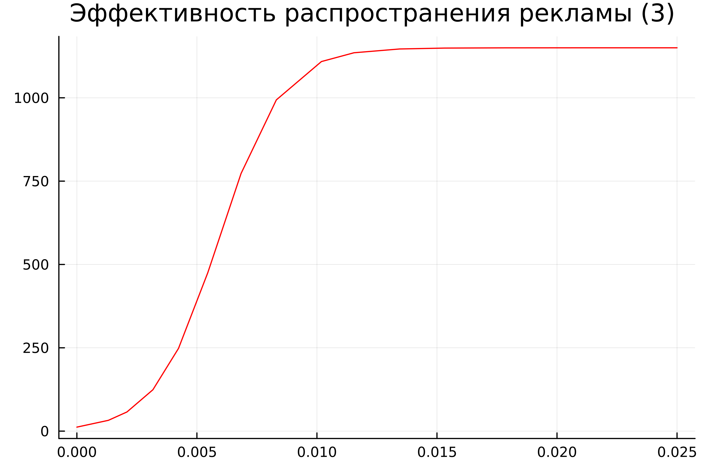
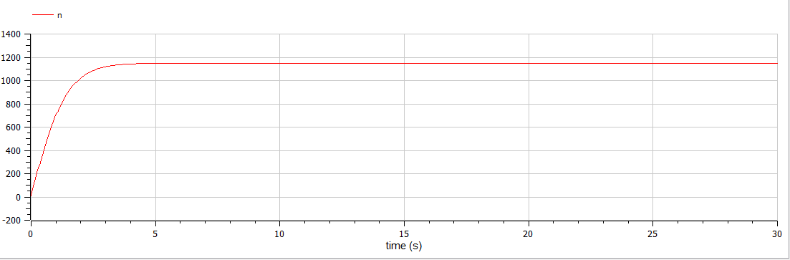
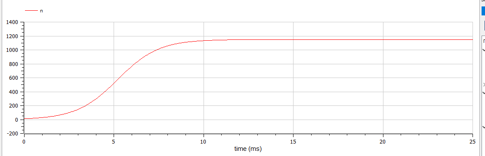
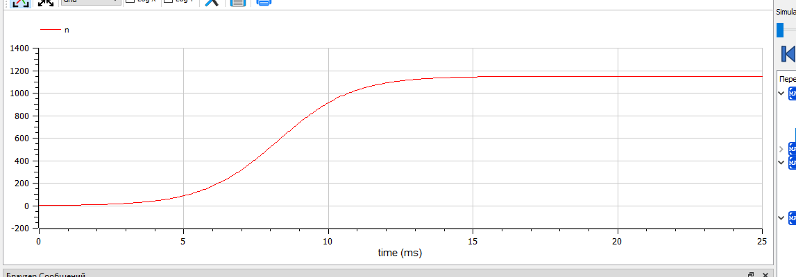

---
## Front matter
lang: ru-RU
title: Лабораторная работа №7
subtitle: 
author:
  - Абдуллина Ляйсан Раисовна
institute:
  - Российский университет дружбы народов, Москва, Россия
date: 19 марта 2024

babel-lang: russian
babel-otherlangs: english
mainfont: Arial
monofont: Courier New
fontsize: 12pt

## Formatting pdf
toc: false
toc-title: Содержание
slide_level: 2
aspectratio: 169
section-titles: true
theme: metropolis
header-includes:
 - \metroset{progressbar=frametitle,sectionpage=progressbar,numbering=fraction}
 - '\makeatletter'
 - '\beamer@ignorenonframefalse'
 - '\makeatother'
---

# Цель работы

Решить задачу об эффективности рекламы.

## Задачи

1. Постройте 3 графика распространения рекламы.

# Условие варианта 39

Постройте график распространения рекламы, математическая модель которой описывается следующим уравнением:

1) $dn/dt = (0.67 + 0.000067(t)n(t))(N-n(t))$

2) $dn/dt = (0.000076 + 0.76(t)n(t))(N-n(t))$

3) $dn/dt = (0.76sin(t) + 0.67cos(t)n(t))(N-n(t))$

# Условие варианта 39

При этом объем аудитории N = 1150, в начальный момент о товаре знает 12 человек. Для случая 2 определите в какой момент времени скорость распространения рекламы будет иметь максимальное значение.

# Julia

Построим численное решение задачи для $dn/dt = (0.67 + 0.000067(t)n(t))(N-n(t))$ (Рис.1):

{#fig:001 width=70%}

# Julia

Построим численное решение задачи для $dn/dt = (0.000076 + 0.76(t)n(t))(N-n(t))$ (Рис.2):

{#fig:002 width=70%}

# Julia

Построим численное решение задачи для$dn/dt = (0.76sin(t) + 0.67cos(t)n(t))(N-n(t))$ (Рис.3):

{#fig:003 width=70%}

# OpenModelica

Построим численное решение задачи для $dn/dt = (0.67 + 0.000067(t)n(t))(N-n(t))$ (Рис.4):

{#fig:004 width=70%}

# OpenModelica

Построим численное решение задачи для $dn/dt = (0.000076 + 0.76(t)n(t))(N-n(t))$ (Рис.5):

{#fig:005 width=70%}

# OpenModelica

Построим численное решение задачи для$dn/dt = (0.76sin(t) + 0.67cos(t)n(t))(N-n(t))$ (Рис.6):

{#fig:006 width=70%}

# Анализ и сравнение результатов

Как можно заметить по графикам на Julia и OpenModelica идентичны (с поправкой на использование разных графических ресурсов, разный масштаб и т.д.).  

# Выводы

Мы смогли решить задачу об эффективности рекламы, а также выполнили все поставленные задачи.

