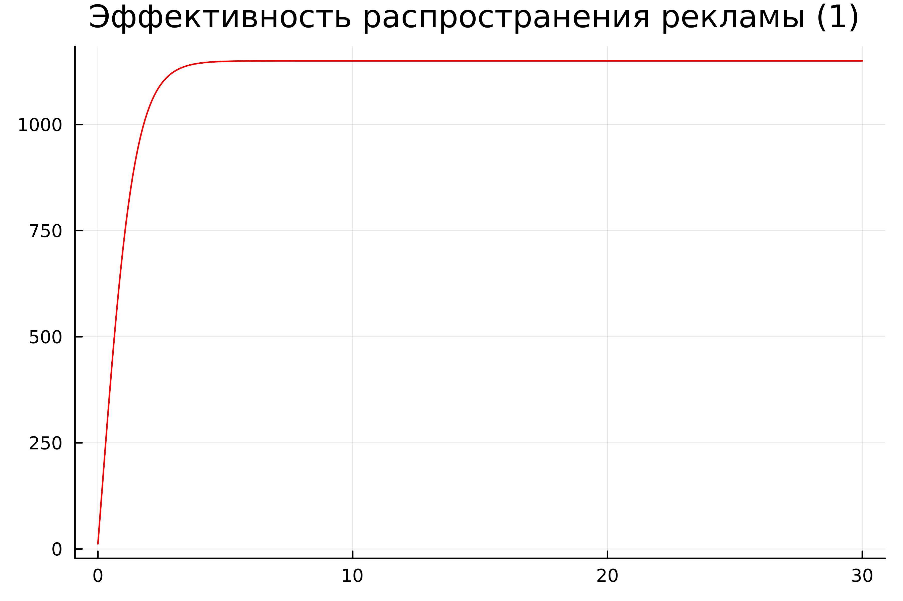
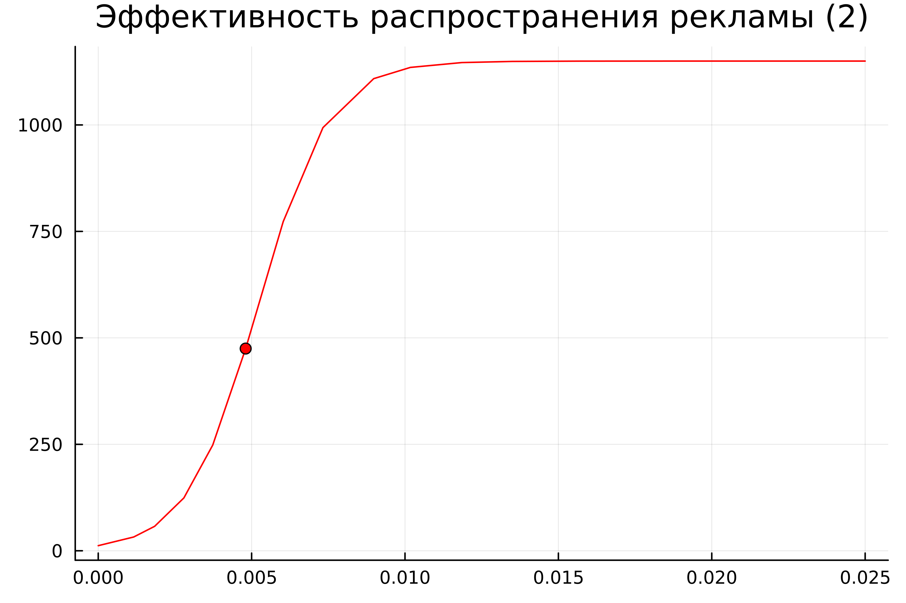
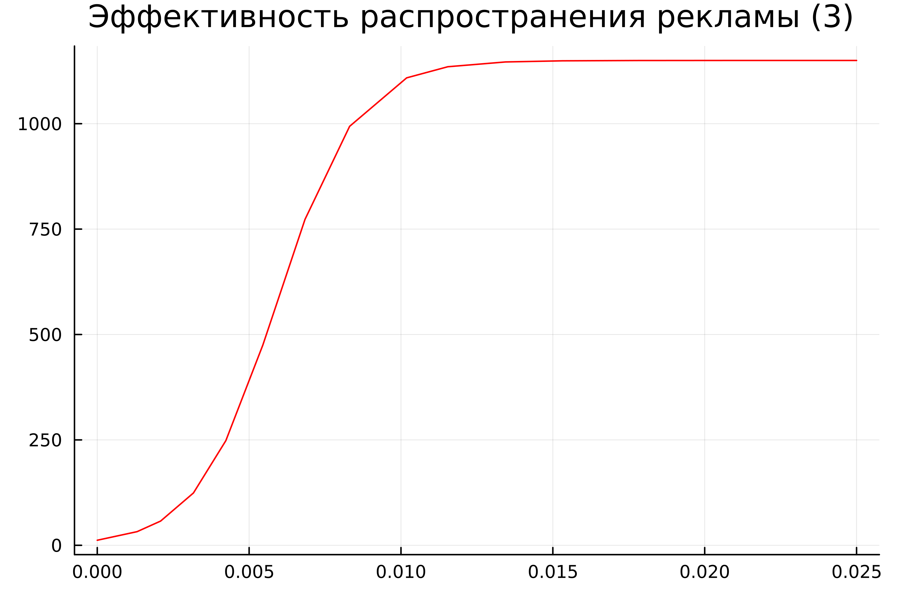
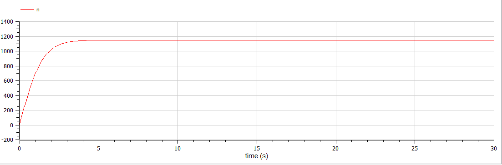
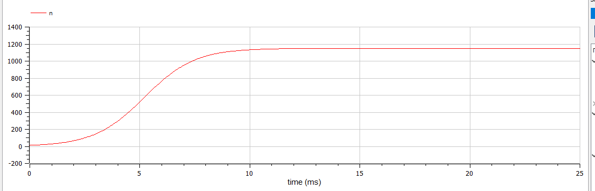
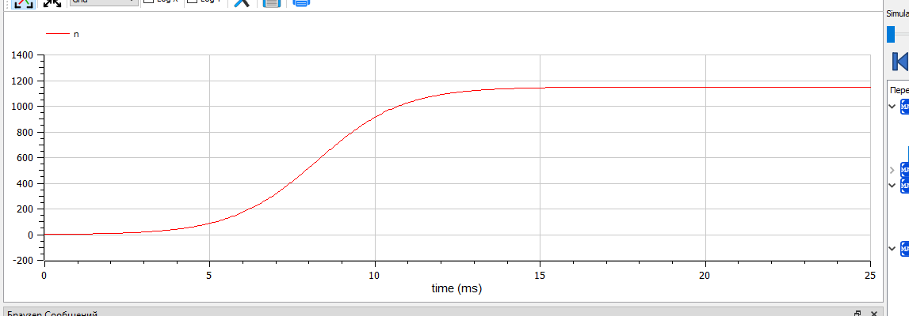

---
## Front matter
title: "Лабораторная работа №7"
subtitle: "Эффективность рекламы. Вариант 39"
author: "Абдуллина Ляйсан Раисовна, НПИбд-01-21"

## Generic otions
lang: ru-RU
toc-title: "Содержание"

## Bibliography
bibliography: bib/cite.bib
csl: pandoc/csl/gost-r-7-0-5-2008-numeric.csl

## Pdf output format
toc: true # Table of contents
toc-depth: 2
lof: true # List of figures
fontsize: 12pt
linestretch: 1.5
papersize: a4
documentclass: scrreprt
## I18n polyglossia
polyglossia-lang:
  name: russian
  options:
	- spelling=modern
	- babelshorthands=true
polyglossia-otherlangs:
  name: english
## I18n babel
babel-lang: russian
babel-otherlangs: english
## Fonts
mainfont: PT Serif
romanfont: PT Serif
sansfont: PT Sans
monofont: PT Mono
mainfontoptions: Ligatures=TeX
romanfontoptions: Ligatures=TeX
sansfontoptions: Ligatures=TeX,Scale=MatchLowercase
monofontoptions: Scale=MatchLowercase,Scale=0.9
## Biblatex
biblatex: true
biblio-style: "gost-numeric"
biblatexoptions:
  - parentracker=true
  - backend=biber
  - hyperref=auto
  - language=auto
  - autolang=other*
  - citestyle=gost-numeric

## Pandoc-crossref LaTeX customization
figureTitle: "Скриншот"
tableTitle: "Таблица"
listingTitle: "Листинг"
lofTitle: "Список иллюстраций"
lotTitle: "Список таблиц"
lolTitle: "Листинги"
## Misc options
indent: true
header-includes:
  - \usepackage{indentfirst}
  - \usepackage{float} # keep figures where there are in the text
  - \floatplacement{figure}{H} # keep figures where there are in the text
---

# Цель работы

Решить задачу об эффективности рекламы.

# Задачи

1. Постройте 3 графика распространения рекламы.

# Теоретическое введение

Организуется рекламная кампания нового товара или услуги. Необходимо, чтобы прибыль будущих продаж с избытком покрывала издержки на рекламу. Вначале расходы могут превышать прибыль, поскольку лишь малая часть потенциальных покупателей будет информирована о новинке. Затем, при увеличении числа продаж, возрастает и прибыль, и, наконец, наступит момент, когда рынок насытиться, и рекламировать товар станет бесполезным.

Предположим, что торговыми учреждениями реализуется некоторая продукция, о которой в момент времени t из числа потенциальных покупателей N знает лишь n покупателей. Для ускорения сбыта продукции запускается реклама по радио, телевидению и других средств массовой информации. После запуска рекламной кампании информация о продукции начнет распространяться среди потенциальных покупателей путем общения друг с другом. Таким образом, после запуска рекламных объявлений скорость изменения числа знающих о продукции людей пропорциональна как числу знающих о товаре покупателей, так и числу покупателей о нем не знающих

Модель рекламной кампании описывается следующими величинами. Считаем, что
$dn/dt$ - скорость изменения со временем числа потребителей, узнавших о товаре и готовых его купить, t - время, прошедшее с начала рекламной кампании, n(t) - число уже информированных клиентов. Эта величина пропорциональна числу покупателей, еще не знающих о нем, это описывается следующим образом: 
$a_1$(t)(N-n(t)), 
где N - общее число потенциальных платежеспособных покупателей, $a_1$(t)- характеризует интенсивность рекламной кампании (зависит от затрат на рекламу в данный момент времени). Помимо этого, узнавшие о товаре потребители также распространяют полученную информацию среди потенциальных покупателей, не знающих о нем (в этом случае работает т.н. сарафанное радио). Этот вклад в рекламу описывается величиной
$a_2$(t)(N-n(t)), эта величина увеличивается с увеличением потребителей
узнавших о товаре. Математическая модель распространения рекламы описывается
уравнением:

$dn/dt = (a_1(t) + a_2(t)n(t))(N-n(t))$

# Выполнение лабораторной работы

## Условие варианта 39

Постройте график распространения рекламы, математическая модель которой описывается следующим уравнением:

1) $dn/dt = (0.67 + 0.000067(t)n(t))(N-n(t))$

2) $dn/dt = (0.000076 + 0.76(t)n(t))(N-n(t))$

3) $dn/dt = (0.76sin(t) + 0.67cos(t)n(t))(N-n(t))$

При этом объем аудитории N = 1150, в начальный момент о товаре знает 12 человек. Для случая 2 определите в какой момент времени скорость распространения рекламы будет иметь максимальное значение.

## Julia

Код для $dn/dt = (0.67 + 0.000067(t)n(t))(N-n(t))$

using Plots
using DifferentialEquations

N = 1150
n0 = 12

function ode_fn(du, u, p, t)
    (n) = u
    du[1] = (0.67 + 0.00076*u[1])*(N - u[1])
end

v0 = [n0]
tspan = (0.0, 30.0)
prob = ODEProblem(ode_fn, v0, tspan)
sol = solve(prob, dtmax = 0.05)
n = [u[1] for u in sol.u]
T = [t for t in sol.t]

plt = plot(
  dpi = 600,
  title = "Эффективность распространения рекламы (1) ",
  legend = false)
plot!(
  plt,
  T,
  n,
  color = :red)

savefig(plt, "lab07_1.png")

Получим следующий график (Рис.1):

{#fig:001 width=70%}

Код для $dn/dt = (0.000076 + 0.76(t)n(t))(N-n(t))$:

using Plots
using DifferentialEquations

N = 1150
n0 = 12

function ode_fn(du, u, p, t)
    (n) = u
    du[1] = (0.000076 + 0.76*u[1])*(N - u[1])
end

v0 = [n0]
tspan = (0.0, 0.025)
prob = ODEProblem(ode_fn, v0, tspan)
sol = solve(prob)
n = [u[1] for u in sol.u]
T = [t for t in sol.t]

max_dn = 0;
max_dn_t = 0;
max_dn_n = 0;
for (i, t) in enumerate(T)
    if sol(t, Val{1})[1] > max_dn
        global max_dn = sol(t, Val{1})[1]
        global max_dn_t = t
        global max_dn_n = n[i]
    end
end

plt = plot(
  dpi = 600,
  title = "Эффективность распространения рекламы (2)",
  legend = false)
plot!(
  plt,
  T,
  n,
  color = :red)
plot!(
  plt,
  [max_dn_t],
  [max_dn_n],
  seriestype = :scatter,
  color = :red)

savefig(plt, "lab07_2.png")

Получим следующий график (Рис.2):

{#fig:002 width=70%}

Код для $dn/dt = (0.76sin(t) + 0.67cos(t)n(t))(N-n(t))$:

using Plots
using DifferentialEquations

N = 1150
n0 = 12

function ode_fn(du, u, p, t)
    (n) = u
    du[1] = (0.76*sin(t)+ 0.67*cos(t)*u[1])*(N - u[1])
end

v0 = [n0]
tspan = (0.0, 0.025)
prob = ODEProblem(ode_fn, v0, tspan)
sol = solve(prob, dtmax = 0.05)
n = [u[1] for u in sol.u]
T = [t for t in sol.t]

plt = plot(
  dpi = 600,
  title = "Эффективность распространения рекламы (3) ",
  legend = false)
plot!(
  plt,
  T,
  n,
  color = :red)

savefig(plt, "lab07_3.png")

Получим следующий график (Рис.3):

{#fig:003 width=70%}

## OpenModelica

Код $dn/dt = (0.67 + 0.000067(t)n(t))(N-n(t))$

model lab07_1
Real N = 1150;
Real n;
initial equation
n = 12;
equation
der(n) = (0.67 + 0.00067*n)*(N-n);
end lab07_1;

Получим следующий график (Рис.4):

{#fig:004 width=70%}

Код для $dn/dt = (0.000076 + 0.76(t)n(t))(N-n(t))$:

model lab07_2
Real N = 1150;
Real n;
initial equation
n = 12;
equation
der(n) = (0.000076 + 0.76*n)*(N-n);
end lab07_2;

Получим следующий график (Рис.5):

{#fig:005 width=70%}

Код для $dn/dt = (0.76sin(t) + 0.67cos(t)n(t))(N-n(t))$:

model lab07_3
Real N = 1150;
Real n;
initial equation
n = 2;
equation
der(n) = (0.76*sin(time) + 0.67*cos(time)*n)*(N-n);
end lab07_3;

Получим следующий график (Рис.6):

{#fig:006 width=70%}

## Анализ и сравнение результатов

В ходе выполнения лабораторной работы были построены графики при заданных начальных условиях на языках Julia и с помощью ПО Open Modelica. Результаты графиков совпадают (не учитывая  разности в масштабах).

# Выводы

Мы решили задачу  об эффективности рекламы и выполнили все поставленне перед нами задачи.

# Список литературы

1. Документация по Julia: https://docs.julialang.org/en/v1/

2. Документация по OpenModelica: https://openmodelica.org/

3. Решение дифференциальных уравнений: https://www.wolframalpha.com/

